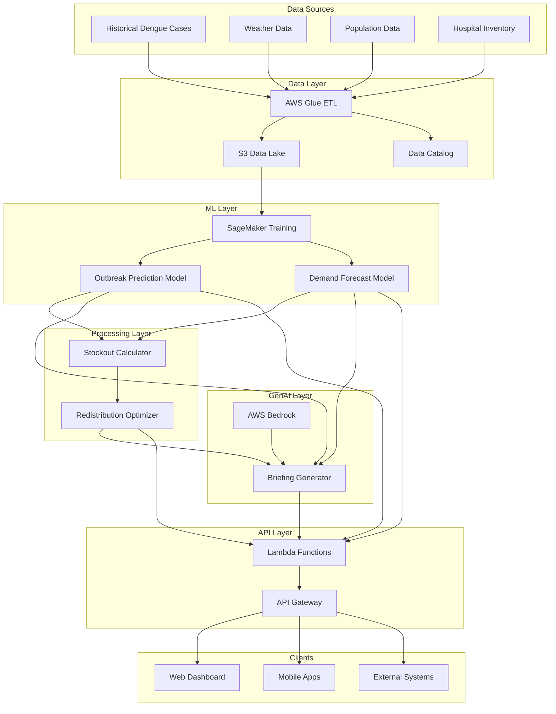

# Design Document: IntelliMed

## Overview

IntelliMed is a cloud-native Public Health Decision Intelligence System built on AWS infrastructure. The system combines time-series forecasting, demand prediction, optimization algorithms, and generative AI to provide actionable intelligence for dengue outbreak management and medical supply chain optimization.

The architecture follows a layered approach:
- **Data Layer**: S3-based data lake with AWS Glue for ETL
- **ML Layer**: SageMaker for training and hosting prediction models
- **Optimization Layer**: Lambda-based constraint optimization engine
- **GenAI Layer**: AWS Bedrock for natural language briefing generation
- **API Layer**: API Gateway with Lambda for RESTful endpoints
- **Security Layer**: IAM, KMS, and CloudWatch for access control and monitoring

## Architecture

### High-Level Architecture



### Data Flow

1. **Ingestion**: Raw data uploaded to S3 landing zone
2. **Validation**: Glue jobs validate schema and data quality
3. **Transformation**: Data normalized and enriched
4. **Storage**: Processed data stored in curated S3 buckets
5. **Training**: SageMaker pulls data for model training
6. **Inference**: Models generate predictions on schedule
7. **Optimization**: Lambda functions compute redistribution plans
8. **Briefing**: Bedrock generates natural language reports
9. **API**: Results exposed via API Gateway endpoints
10. **Consumption**: Clients retrieve data via REST APIs

## Components and Interfaces

### 1. Data Pipeline Component

**Purpose**: Ingest, validate, transform, and store multi-source health data

**Subcomponents**:
- **S3 Landing Zone**: Raw data upload buckets organized by source type
- **Glue ETL Jobs**: Validation and transformation logic
- **Data Catalog**: Metadata repository for data discovery
- **Curated Data Store**: Processed data ready for ML consumption

**Interfaces**:

```python
class DataPipeline:
    def ingest_dengue_cases(self, file_path: str, district: str, date_range: DateRange) -> IngestionResult
    def ingest_weather_data(self, file_path: str, station_id: str, date_range: DateRange) -> IngestionResult
    def ingest_population_data(self, file_path: str, district: str, year: int) -> IngestionResult
    def ingest_inventory_data(self, file_path: str, facility_id: str, timestamp: datetime) -> IngestionResult
    def validate_schema(self, data: DataFrame, schema: Schema) -> ValidationResult
    def transform_data(self, source_bucket: str, target_bucket: str, transformation: str) -> TransformResult
    def get_data_quality_metrics(self, dataset: str, date_range: DateRange) -> QualityMetrics
```

**Data Schemas**:

```python
# Dengue Cases Schema
DengueCaseRecord = {
    "district_id": str,
    "date": date,
    "confirmed_cases": int,
    "suspected_cases": int,
    "deaths": int,
    "age_group": str,
    "gender": str
}

# Weather Data Schema
WeatherRecord = {
    "station_id": str,
    "district_id": str,
    "date": date,
    "rainfall_mm": float,
    "temperature_celsius": float,
    "humidity_percent": float,
    "wind_speed_kmh": float
}

# Inventory Schema
InventoryRecord = {
    "facility_id": str,
    "district_id": str,
    "timestamp": datetime,
    "supply_type": str,
    "quantity": int,
    "unit": str,
    "expiry_date": date
}
```

**Validation Rules**:
- District IDs must match official government codes
- Dates must be in ISO 8601 format
- Numeric values must be non-negative
- Required fields cannot be null
- Timestamps must be within reasonable bounds (not future dates)

### 2. Outbreak Prediction Engine

**Purpose**: Forecast dengue outbreak probability using time-series ML models

**Subcomponents**:
- **Feature Engineering**: Compute lagged features, rolling averages, seasonality indicators
- **Model Training**: SageMaker training jobs with XGBoost or LSTM
- **Model Hosting**: SageMaker endpoints for real-time inference
- **Prediction Scheduler**: EventBridge-triggered Lambda for daily predictions

**Interfaces**:

```python
class OutbreakPredictor:
    def train_model(self, training_data: DataFrame, hyperparameters: dict) -> ModelArtifact
    def deploy_model(self, model_artifact: ModelArtifact, endpoint_name: str) -> Endpoint
    def predict_outbreak(self, district_id: str, forecast_horizon: int) -> OutbreakPrediction
    def batch_predict(self, district_ids: List[str], forecast_horizon: int) -> List[OutbreakPrediction]
    def get_feature_importance(self, district_id: str) -> FeatureImportance
    def get_model_metrics(self, model_version: str) -> ModelMetrics
```

**Data Structures**:

```python
OutbreakPrediction = {
    "district_id": str,
    "prediction_date": date,
    "forecast_date": date,
    "outbreak_probability": float,  # 0-1
    "risk_level": str,  # "low", "moderate", "high"
    "confidence_interval": {
        "lower": float,
        "upper": float
    },
    "confidence_score": float,
    "contributing_factors": List[FeatureFactor]
}

FeatureFactor = {
    "feature_name": str,
    "importance_score": float,
    "current_value": float,
    "historical_average": float
}
```

**ML Model Architecture**:
- **Algorithm**: Gradient Boosting (XGBoost) or LSTM for time-series
- **Features**: 
  - Lagged case counts (7, 14, 21, 28 days)
  - Rolling averages (7-day, 14-day)
  - Weather features (current and lagged)
  - Seasonality indicators (month, week of year)
  - Population density
  - Historical outbreak indicators
- **Target**: Binary classification (outbreak vs no outbreak) or regression (case count)
- **Training**: Weekly retraining with expanding window
- **Validation**: Time-series cross-validation with walk-forward approach

### 3. Demand Forecasting Engine

**Purpose**: Predict medical supply requirements based on outbreak forecasts

**Subcomponents**:
- **Consumption Model**: Historical consumption rates per case
- **Demand Calculator**: Translates case forecasts to supply needs
- **Inventory Tracker**: Current stock levels by facility
- **Net Requirement Computer**: Demand minus current inventory

**Interfaces**:

```python
class DemandForecaster:
    def forecast_demand(self, district_id: str, outbreak_prediction: OutbreakPrediction) -> DemandForecast
    def calculate_consumption_rate(self, supply_type: str, historical_data: DataFrame) -> ConsumptionRate
    def get_current_inventory(self, facility_id: str, supply_type: str) -> InventoryLevel
    def compute_net_requirement(self, facility_id: str, forecast: DemandForecast) -> NetRequirement
    def batch_forecast(self, district_ids: List[str]) -> List[DemandForecast]
```

**Data Structures**:

```python
DemandForecast = {
    "facility_id": str,
    "district_id": str,
    "forecast_date": date,
    "horizon_days": int,
    "supply_forecasts": List[SupplyForecast]
}

SupplyForecast = {
    "supply_type": str,
    "predicted_demand": int,
    "current_inventory": int,
    "net_requirement": int,
    "confidence_interval": {
        "lower": int,
        "upper": int
    }
}

ConsumptionRate = {
    "supply_type": str,
    "units_per_case": float,
    "standard_deviation": float,
    "data_source": str  # "historical" or "national_average"
}
```

**Demand Calculation Logic**:

```
predicted_cases = outbreak_prediction.expected_cases
consumption_rate = get_consumption_rate(supply_type)
predicted_demand = predicted_cases * consumption_rate.units_per_case
current_inventory = get_inventory(facility_id, supply_type)
net_requirement = max(0, predicted_demand - current_inventory)
```

### 4. Stockout Probability Estimator

**Purpose**: Calculate probability of inventory depletion before replenishment

**Interfaces**:

```python
class StockoutEstimator:
    def estimate_stockout_probability(self, facility_id: str, supply_type: str, horizon_days: int) -> StockoutProbability
    def rank_facilities_by_risk(self, district_id: str) -> List[FacilityRisk]
    def identify_critical_facilities(self, threshold: float) -> List[str]
```

**Data Structures**:

```python
StockoutProbability = {
    "facility_id": str,
    "supply_type": str,
    "stockout_probability": float,  # 0-1
    "priority_level": str,  # "critical", "high", "medium", "low"
    "days_until_stockout": int,
    "current_inventory": int,
    "daily_consumption_rate": float,
    "demand_forecast": int
}
```

**Calculation Logic**:

```
daily_consumption = demand_forecast / horizon_days
days_until_stockout = current_inventory / daily_consumption
stockout_probability = 1 - exp(-lambda * max(0, horizon_days - days_until_stockout))

if stockout_probability > 0.8:
    priority = "critical"
elif stockout_probability > 0.5:
    priority = "high"
else:
    priority = "medium"
```

### 5. Redistribution Optimization Engine

**Purpose**: Generate optimal supply transfer recommendations to minimize stockout risk

**Subcomponents**:
- **Optimization Solver**: Linear programming solver (PuLP or OR-Tools)
- **Constraint Manager**: Defines feasibility constraints
- **Cost Calculator**: Transportation and logistics cost estimation
- **Solution Validator**: Ensures recommendations are executable

**Interfaces**:

```python
class RedistributionOptimizer:
    def optimize_redistribution(self, district_id: str, stockout_risks: List[StockoutProbability]) -> RedistributionPlan
    def validate_plan(self, plan: RedistributionPlan) -> ValidationResult
    def estimate_cost(self, plan: RedistributionPlan) -> CostEstimate
    def generate_logistics_instructions(self, plan: RedistributionPlan) -> LogisticsInstructions
```

**Data Structures**:

```python
RedistributionPlan = {
    "plan_id": str,
    "creation_date": datetime,
    "district_id": str,
    "transfers": List[Transfer],
    "total_cost": float,
    "expected_stockout_reduction": float,
    "execution_timeline": str
}

Transfer = {
    "transfer_id": str,
    "supply_type": str,
    "quantity": int,
    "from_facility_id": str,
    "to_facility_id": str,
    "priority": int,
    "estimated_cost": float,
    "distance_km": float,
    "estimated_duration_hours": float
}
```

**Optimization Formulation**:

```
Objective: Minimize total weighted stockout probability

Decision Variables:
x[i,j,s] = quantity of supply s transferred from facility i to facility j

Constraints:
1. Supply conservation: sum(x[i,j,s]) <= inventory[i,s] - safety_stock[i,s]
2. Demand satisfaction: sum(x[i,j,s]) >= net_requirement[j,s] (soft constraint)
3. Transportation capacity: sum(x[i,j,s] * volume[s]) <= truck_capacity
4. Non-negativity: x[i,j,s] >= 0

Objective Function:
minimize: sum(w[j] * stockout_prob[j] - alpha * sum(x[i,j,s]))
where w[j] = priority weight for facility j
```

### 6. AI Briefing Generator

**Purpose**: Generate natural language situation reports using AWS Bedrock

**Subcomponents**:
- **Data Aggregator**: Collects predictions, forecasts, and recommendations
- **Prompt Constructor**: Builds structured prompts for LLM
- **Bedrock Client**: Interfaces with Claude or similar model
- **Report Formatter**: Structures output for readability

**Interfaces**:

```python
class BriefingGenerator:
    def generate_briefing(self, district_id: str, language: str) -> SituationBriefing
    def generate_executive_summary(self, state_id: str) -> ExecutiveSummary
    def explain_prediction(self, prediction: OutbreakPrediction) -> Explanation
    def translate_briefing(self, briefing: SituationBriefing, target_language: str) -> SituationBriefing
```

**Data Structures**:

```python
SituationBriefing = {
    "briefing_id": str,
    "generation_date": datetime,
    "district_id": str,
    "language": str,
    "summary": str,
    "risk_assessment": str,
    "key_findings": List[str],
    "recommended_actions": List[Action],
    "data_sources": List[str],
    "confidence_level": str
}

Action = {
    "action_id": int,
    "description": str,
    "rationale": str,
    "priority": str,
    "estimated_impact": str
}
```

**Prompt Template**:

```
You are a public health analyst generating a situation briefing for district health officers.

Context:
- District: {district_name}
- Current Date: {current_date}
- Outbreak Probability: {outbreak_prob}% (Risk Level: {risk_level})
- Predicted Cases (7-day): {predicted_cases}
- Critical Supply Gaps: {critical_supplies}

Key Data:
{structured_data}

Generate a concise briefing (200-300 words) that:
1. Summarizes the current situation
2. Highlights top 3 risks
3. Recommends 3 specific actions with rationale
4. Includes confidence levels for key predictions

Tone: Professional, actionable, non-alarmist
Format: Executive briefing style
```

### 7. API Gateway Layer

**Purpose**: Expose system functionality via RESTful APIs

**Endpoints**:

```
GET /api/v1/predictions/outbreak
  Query Parameters: district_id, date, horizon
  Response: OutbreakPrediction

GET /api/v1/forecasts/demand
  Query Parameters: district_id, facility_id, supply_type
  Response: DemandForecast

GET /api/v1/stockout/risk
  Query Parameters: district_id, threshold
  Response: List[StockoutProbability]

GET /api/v1/redistribution/plan
  Query Parameters: district_id
  Response: RedistributionPlan

GET /api/v1/briefing
  Query Parameters: district_id, language
  Response: SituationBriefing

POST /api/v1/data/ingest
  Body: DataUpload
  Response: IngestionResult
```

**Authentication**:
- API Key-based authentication
- IAM role-based access for AWS services
- Rate limiting: 100 requests/minute per key
- JWT tokens for user sessions

**Error Responses**:

```python
ErrorResponse = {
    "error_code": str,
    "message": str,
    "details": dict,
    "timestamp": datetime,
    "request_id": str
}
```

## Data Models

### Core Entities

```python
class District:
    district_id: str
    name: str
    state: str
    population: int
    area_sq_km: float
    urban_rural: str
    coordinates: GeoPoint

class Facility:
    facility_id: str
    name: str
    district_id: str
    facility_type: str  # "hospital", "clinic", "warehouse"
    bed_capacity: int
    coordinates: GeoPoint
    contact_info: ContactInfo

class Supply:
    supply_id: str
    name: str
    category: str  # "diagnostic", "treatment", "prevention"
    unit: str
    shelf_life_days: int
    storage_requirements: str

class User:
    user_id: str
    name: str
    role: str  # "DHO", "analyst", "admin"
    district_id: str
    email: str
    phone: str
    notification_preferences: NotificationPrefs
```

### Relationship Model

```mermaid
erDiagram
    DISTRICT ||--o{ FACILITY : contains
    DISTRICT ||--o{ OUTBREAK_PREDICTION : has
    FACILITY ||--o{ INVENTORY : maintains
    FACILITY ||--o{ DEMAND_FORECAST : receives
    SUPPLY ||--o{ INVENTORY : tracked_in
    SUPPLY ||--o{ DEMAND_FORECAST : forecasted
    REDISTRIBUTION_PLAN ||--o{ TRANSFER : contains
    TRANSFER }o--|| FACILITY : from
    TRANSFER }o--|| FACILITY : to
    USER }o--|| DISTRICT : manages
```

### Database Schema (DynamoDB Tables)

**Table: Predictions**
- Partition Key: district_id
- Sort Key: prediction_date#forecast_date
- Attributes: outbreak_probability, risk_level, confidence, features

**Table: Forecasts**
- Partition Key: facility_id
- Sort Key: forecast_date#supply_type
- Attributes: predicted_demand, current_inventory, net_requirement

**Table: Inventory**
- Partition Key: facility_id
- Sort Key: supply_type#timestamp
- Attributes: quantity, unit, expiry_date, last_updated

**Table: Plans**
- Partition Key: plan_id
- Sort Key: creation_date
- Attributes: district_id, transfers, status, cost

## Correctness Properties

*A property is a characteristic or behavior that should hold true across all valid executions of a system—essentially, a formal statement about what the system should do. Properties serve as the bridge between human-readable specifications and machine-verifiable correctness guarantees.*

