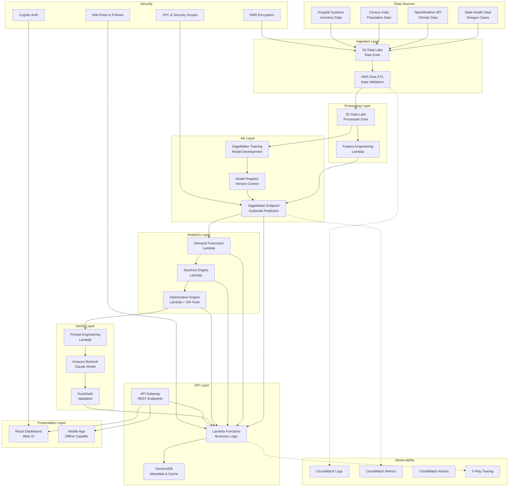
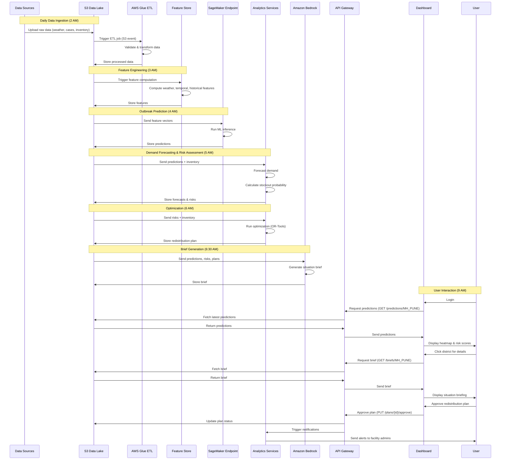

# Design Document: SurgeShield AI - Outbreak Intelligence & Healthcare Readiness Platform

## Executive Summary

SurgeShield AI is a production-grade AI-powered decision intelligence system designed to predict dengue outbreaks, forecast medical resource demand, estimate stockout probability, and recommend proactive resource allocation actions across India's public health infrastructure. The platform addresses the critical challenge of reactive outbreak response by providing 7-14 days of advance warning, enabling hospitals and district health offices to prepare resources before case surges overwhelm capacity.

The system integrates multiple AWS services (S3, Glue, SageMaker, Bedrock, Lambda, API Gateway) with custom ML models, probabilistic stockout modeling, and operations research optimization to deliver actionable intelligence through role-based dashboards. Initial deployment targets 100 districts across dengue-endemic states, with architecture designed for horizontal scaling to additional diseases and geographies.

**Key Value Propositions:**
- 7-14 days advance warning of dengue outbreaks (vs. 0 days with reactive systems)
- 40-60% reduction in emergency procurement costs through proactive inventory management
- 30-50% reduction in stockout incidents through optimized redistribution
- 20-30% improvement in bed occupancy stability during surge periods
- AI-generated situation briefings reducing decision-making time from hours to minutes

**Technology Foundation:**
- AWS cloud infrastructure for scalability and reliability
- SageMaker for ML model training and inference
- Bedrock (Claude) for natural language situation briefings
- Python + OR-Tools for optimization
- React for responsive web dashboard
- RESTful APIs for system integration

## Problem Analysis

### Current State Challenges

**Reactive Detection:** India's current dengue surveillance relies on case reporting, which lags actual infection by 5-7 days (incubation period) plus reporting delays. By the time outbreaks are detected, hospitals are already experiencing patient surges.

**Resource Fragmentation:** Hospital inventory management operates in silos. Facilities 50km apart may simultaneously experience stockouts and excess inventory without coordination mechanisms.

**Emergency Procurement Costs:** Reactive procurement during outbreaks incurs 2-3x normal costs due to urgent delivery requirements and supplier scarcity during high-demand periods.

**Capacity Planning Gaps:** Hospitals lack tools to forecast bed requirements and staffing needs, leading to overcrowding, delayed care, and staff burnout during outbreaks.

**Information Asymmetry:** District health officers lack unified visibility into facility-level preparedness, resource status, and emerging risks across their jurisdiction.

### Root Causes

1. **Absence of Predictive Analytics:** No system integrates climate signals (temperature, rainfall, humidity) with historical outbreak patterns for forward-looking risk assessment
2. **Siloed Data Systems:** Health data, weather data, and inventory data exist in separate systems without integration
3. **Manual Coordination:** Resource redistribution requires phone calls, emails, and manual tracking
4. **Limited Decision Support:** Officers rely on experience and intuition rather than data-driven recommendations
5. **Delayed Information Flow:** Case data aggregation and reporting takes 3-7 days, missing the window for proactive action

### Impact Quantification

- **Stockout Frequency:** 15-25% of facilities experience platelet stockouts during outbreak peaks
- **Emergency Procurement:** 30-40% of outbreak-period procurement is emergency (vs. 5-10% baseline)
- **Bed Occupancy Spikes:** 120-150% occupancy during peaks (vs. 70-80% baseline)
- **Lead Time:** 0 days advance warning with current systems
- **Coordination Time:** 4-8 hours for manual resource redistribution coordination

## Vision & Objectives

### Vision Statement

Transform India's outbreak response from reactive crisis management to proactive preparedness through AI-powered predictive intelligence, enabling every district and hospital to anticipate, prepare for, and effectively manage disease outbreaks with optimized resource allocation.

### Strategic Objectives

1. **Predictive Capability:** Provide 7-14 days advance warning of dengue outbreaks with 80%+ accuracy (AUC-ROC ≥ 0.80)
2. **Resource Optimization:** Reduce stockout incidents by 30-50% through predictive demand forecasting and optimized redistribution
3. **Cost Efficiency:** Decrease emergency procurement by 40-60% through proactive inventory management
4. **Operational Readiness:** Improve bed occupancy stability by 20-30% through surge capacity planning
5. **Decision Acceleration:** Reduce decision-making time from hours to minutes through AI-generated situation briefings
6. **Scalability:** Design for expansion to 500+ districts and 5+ diseases within 3 years
7. **Integration:** Seamless data exchange with existing state health information systems
8. **Accessibility:** Support users across connectivity levels (urban broadband to rural 3G)

### Success Criteria

**Technical Performance:**
- Outbreak prediction AUC-ROC ≥ 0.80
- Demand forecast MAPE ≤ 20%
- API latency p95 ≤ 500ms
- Dashboard load time ≤ 3 seconds
- System uptime ≥ 99.5%

**Operational Impact:**
- Lead time: 7-14 days advance warning
- Stockout reduction: 30-50%
- Emergency procurement reduction: 40-60%
- Bed occupancy variance reduction: 20-30%
- User adoption: 80%+ of target users active monthly

## Stakeholders

### Primary Stakeholders

**District Health Officers (DHOs)**
- Responsible for outbreak monitoring and coordination across 50-200 facilities
- Need: District-wide risk visibility, resource allocation recommendations, situation briefings for state reporting
- Pain Points: Fragmented information, manual coordination, delayed awareness of emerging risks

**Hospital Administrators**
- Manage facility-level inventory, capacity, and procurement
- Need: Demand forecasts, stockout alerts, redistribution coordination
- Pain Points: Unpredictable demand, emergency procurement costs, inventory optimization challenges

**Clinicians**
- Frontline patient care during outbreaks
- Need: Surge timeline awareness, resource availability status, preparedness guidance
- Pain Points: Sudden patient influx, resource shortages, lack of advance warning

### Secondary Stakeholders

**State Health Departments**
- Policy and budget authority, multi-district coordination
- Need: State-level dashboards, performance metrics, cost-benefit analysis

**Supply Chain Managers**
- Procurement and logistics coordination
- Need: Demand forecasts, lead time requirements, supplier coordination

**Data Scientists / ML Engineers**
- Model development, training, evaluation, improvement
- Need: Training pipelines, experiment tracking, model versioning, performance monitoring

**System Administrators**
- Infrastructure management, monitoring, incident response
- Need: Observability tools, alerting, deployment automation, security controls

**External System Integrators**
- Connect SurgeShield AI with existing health IT systems
- Need: API documentation, data schemas, integration support

## User Personas

### Persona 1: Dr. Rajesh Kumar - District Health Officer

**Demographics:**
- Age: 42, MBBS + MPH, 15 years in public health
- Manages 120 facilities across 8 sub-districts
- Works from district headquarters with reliable internet

**Goals:**
- Prevent hospital overwhelm during outbreaks
- Optimize resource allocation across facilities
- Report preparedness status to state officials
- Minimize emergency procurement costs

**Behaviors:**
- Checks dashboard daily at 9 AM
- Reviews weekly reports for state meetings
- Coordinates with hospital admins via phone and WhatsApp
- Makes redistribution decisions based on facility requests

**Pain Points:**
- Learns about outbreaks after they start
- Spends 4-6 hours coordinating resource transfers manually
- Struggles to justify proactive procurement to budget officers
- Lacks data to support resource allocation decisions

**Technology Comfort:** High - uses email, spreadsheets, video conferencing daily

### Persona 2: Mrs. Priya Sharma - Hospital Administrator

**Demographics:**
- Age: 38, MBA in Hospital Management, 10 years experience
- Manages 200-bed district hospital
- Works on-site with intermittent internet connectivity

**Goals:**
- Maintain adequate inventory of critical supplies
- Avoid stockouts during patient surges
- Minimize emergency procurement costs
- Ensure bed availability for critical patients

**Behaviors:**
- Reviews inventory daily
- Places orders weekly (or emergency orders as needed)
- Coordinates with DHO for resource transfers
- Tracks bed occupancy hourly during outbreaks

**Pain Points:**
- Unpredictable demand makes inventory planning difficult
- Emergency procurement costs 2-3x normal prices
- Stockouts force patient transfers to other facilities
- Lacks visibility into district-wide resource availability

**Technology Comfort:** Medium - uses hospital management software, email, basic Excel

### Persona 3: Dr. Amit Verma - Clinician

**Demographics:**
- Age: 35, MBBS + MD Internal Medicine, 8 years experience
- Works in emergency department of district hospital
- Accesses systems via mobile during rounds

**Goals:**
- Provide timely care to dengue patients
- Anticipate resource needs for patient management
- Prepare for patient surges
- Minimize patient transfers due to resource unavailability

**Behaviors:**
- Checks patient census multiple times daily
- Requests resources from pharmacy/blood bank as needed
- Communicates with hospital admin about capacity concerns
- Focuses on clinical care, limited time for administrative systems

**Pain Points:**
- Sudden patient influx without warning
- Platelet shortages delay critical transfusions
- Overcrowding compromises care quality
- Lacks advance notice to prepare for surges

**Technology Comfort:** Medium - uses mobile apps, EMR systems, prefers simple interfaces


## User Journeys by Role

### Journey 1: District Health Officer - Morning Risk Assessment

**Context:** Dr. Rajesh starts his workday by assessing outbreak risk across his district

**Steps:**
1. Logs into SurgeShield AI dashboard at 9 AM
2. Views district heatmap showing 3 sub-districts in yellow (medium risk), 5 in green (low risk)
3. Clicks on "Malpur" sub-district (Risk Score: 0.65, Surge Window: 10 days)
4. Reviews AI-generated situation brief: "Malpur shows elevated risk due to recent rainfall (120mm in 7 days) and rising temperatures (avg 32°C). Historical patterns suggest case onset in 8-12 days. Current platelet inventory: 45 units. Predicted demand: 85 units. Stockout probability: 0.72 (critical)."
5. Examines recommended actions: "Transfer 25 platelet units from Rajpur facility (excess inventory). Initiate procurement of 20 units from State Blood Bank."
6. Approves redistribution plan with one click
7. Downloads weekly report PDF for state meeting
8. Receives confirmation: "Redistribution plan sent to Malpur and Rajpur hospital admins"

**Outcome:** Proactive resource allocation initiated 10 days before predicted surge, preventing stockout

**Time:** 15 minutes (vs. 4-6 hours with manual coordination)

### Journey 2: Hospital Administrator - Inventory Risk Alert

**Context:** Mrs. Sharma receives a critical stockout alert on her mobile

**Steps:**
1. Receives WhatsApp alert at 2 PM: "CRITICAL: Platelet stockout risk 0.78. Predicted shortage in 4 days. View details: [link]"
2. Opens dashboard on mobile, navigates to inventory section
3. Views current inventory: 18 platelet units, daily consumption: 4 units, incoming demand forecast: 12 units/day (outbreak predicted)
4. Reviews redistribution plan: "Incoming transfer: 25 units from Rajpur (arrival: 2 days). Recommended procurement: 15 units from State Blood Bank."
5. Clicks "Accept Transfer" to confirm receipt capability
6. Initiates procurement request through integrated system
7. Sets reminder to track transfer arrival
8. Views updated stockout probability: 0.28 (low risk)

**Outcome:** Stockout prevented through coordinated redistribution and targeted procurement

**Time:** 10 minutes

### Journey 3: Clinician - Surge Preparedness Check

**Context:** Dr. Verma checks preparedness status during morning rounds

**Steps:**
1. Opens SurgeShield AI mobile app during break
2. Views facility preparedness summary: "Surge expected in 8 days. Predicted peak: 35 dengue admissions (current capacity: 40 beds). Resource status: Platelets - adequate, IV fluids - adequate, Beds - adequate."
3. Reviews preparedness checklist: "✓ Inventory secured, ✓ Staff scheduling adjusted, ⚠ Isolation ward setup pending"
4. Notes pending action, discusses with hospital admin
5. Checks case trend graph showing gradual increase over past week
6. Feels prepared for upcoming surge

**Outcome:** Clinical team has advance awareness and confidence in resource availability

**Time:** 5 minutes

### Journey 4: District Health Officer - Post-Outbreak Review

**Context:** Dr. Rajesh reviews system performance after outbreak concludes

**Steps:**
1. Navigates to "Performance Metrics" section
2. Views outbreak timeline: Prediction made 12 days before peak, actual peak matched forecast within 2 days
3. Reviews forecast accuracy: Demand forecast MAPE: 15% (good accuracy)
4. Examines resource metrics: 0 stockouts (vs. 3 in previous outbreak), emergency procurement: 5% (vs. 35% previous)
5. Reads impact summary: "Lead time: 12 days. Stockouts prevented: 3. Emergency procurement reduction: 30%. Estimated cost savings: ₹4.2 lakhs."
6. Downloads performance report for state submission
7. Provides feedback: "System performed well. Request: Add vaccine inventory tracking for future."

**Outcome:** Quantified impact demonstrates system value, informs continuous improvement

**Time:** 20 minutes

## Detailed Use Cases

### Use Case 1: Outbreak Prediction and Alert Generation

**Actor:** System (automated), District Health Officer (recipient)

**Preconditions:**
- Weather data updated daily
- Historical case data available for past 2 years
- ML model trained and deployed

**Trigger:** Daily prediction job scheduled at 2 AM

**Main Flow:**
1. ETL pipeline extracts latest weather data (temperature, humidity, rainfall) for all districts
2. ETL pipeline retrieves case data from past 90 days
3. ETL pipeline calculates derived features (7-day rainfall total, temperature trend, seasonal index)
4. SageMaker endpoint receives feature vectors for all districts
5. ML model generates Risk Score and Confidence Score for each district
6. System calculates Surge Window based on historical outbreak progression patterns
7. System classifies districts: high-risk (>0.7), medium-risk (0.4-0.7), low-risk (<0.4)
8. For high-risk districts, system triggers alert workflow
9. Alert system sends notifications to District Health Officers via email and WhatsApp
10. Dashboard updates heatmap with new risk scores
11. System logs prediction with timestamp for performance tracking

**Postconditions:**
- Risk scores updated for all districts
- Alerts sent to relevant users
- Dashboard reflects current risk landscape

**Alternative Flows:**
- 4a. If SageMaker endpoint unavailable, system retries 3 times, then alerts administrators
- 7a. If district transitions from low to high risk, system highlights the change in alert

**Business Rules:**
- Predictions run daily at 2 AM to ensure fresh data for morning review
- Alerts sent only for high-risk districts to avoid alert fatigue
- Confidence scores below 0.6 trigger additional data quality checks

### Use Case 2: Demand Forecasting and Stockout Risk Assessment

**Actor:** System (automated), Hospital Administrator (recipient)

**Preconditions:**
- Outbreak predicted for district (Risk Score > 0.4)
- Current inventory levels known for all facilities
- Historical consumption patterns available

**Trigger:** Outbreak prediction generated

**Main Flow:**
1. Demand Forecaster retrieves predicted case count from outbreak model
2. System calculates resource requirements using case-to-resource ratios (e.g., 60% of severe dengue cases require platelets)
3. System generates daily demand forecast for Surge Window period
4. System retrieves current inventory levels from hospital management systems
5. Stockout Engine calculates consumption rate based on current + predicted demand
6. Stockout Engine models demand uncertainty using historical variance
7. Stockout Engine incorporates supplier lead times (3-5 days for platelets)
8. System calculates Stockout Probability using Monte Carlo simulation (10,000 iterations)
9. System classifies resources: critical risk (>0.6), moderate risk (0.3-0.6), low risk (<0.3)
10. For critical risk resources, system triggers alert to Hospital Administrator
11. System estimates "days until stockout" for at-risk resources
12. Dashboard displays demand forecast, current inventory, and stockout probability

**Postconditions:**
- Demand forecasts available for all facilities in affected district
- Stockout risks identified and communicated
- Hospital administrators aware of inventory gaps

**Alternative Flows:**
- 4a. If inventory data unavailable, system uses last known values and flags data staleness
- 8a. If stockout probability calculation fails, system uses deterministic model as fallback

**Business Rules:**
- Demand forecasts updated daily as predictions refine
- Stockout alerts sent when probability exceeds 0.6 or increases by >0.2 in 24 hours
- Safety stock levels: 7 days for platelets, 14 days for IV fluids

### Use Case 3: Resource Redistribution Optimization

**Actor:** Optimization Engine (automated), District Health Officer (approver)

**Preconditions:**
- Stockout risks identified across multiple facilities
- Inventory levels known for all facilities in district
- Transportation network and costs available

**Trigger:** Stockout probability exceeds 0.6 at one or more facilities

**Main Flow:**
1. Optimization Engine retrieves inventory levels for all facilities in district
2. System identifies facilities with excess inventory (above safety stock + predicted demand)
3. System identifies facilities with deficit (below safety stock or high stockout risk)
4. System formulates optimization problem:
   - Objective: Minimize total stockout risk across district
   - Constraints: No facility below minimum safety stock, transportation capacity limits, transfer costs
5. OR-Tools solver generates optimal redistribution plan (source, destination, quantity for each transfer)
6. System calculates impact: stockout risk reduction, cost, logistics requirements
7. System generates redistribution plan document with facility-specific instructions
8. Dashboard presents plan to District Health Officer with visual map of transfers
9. DHO reviews and approves plan
10. System sends transfer instructions to source and destination Hospital Administrators
11. System creates tracking records for each transfer
12. System updates inventory projections assuming transfers complete

**Postconditions:**
- Redistribution plan approved and communicated
- Facilities aware of incoming/outgoing transfers
- District-wide stockout risk reduced

**Alternative Flows:**
- 5a. If no feasible redistribution exists (all facilities in deficit), system recommends procurement quantities and suppliers
- 9a. If DHO rejects plan, system allows manual adjustments and recalculates impact

**Business Rules:**
- Transfers prioritized by urgency (highest stockout probability first)
- Maximum transfer distance: 100km (2-hour transport time)
- Minimum transfer quantity: 5 units (avoid inefficient small transfers)
- Optimization runs within 5 minutes to enable real-time decision-making

### Use Case 4: AI Situation Brief Generation

**Actor:** GenAI Brief Generator (automated), District Health Officer (recipient)

**Preconditions:**
- Risk scores, demand forecasts, and stockout assessments available
- Redistribution plan generated (if applicable)
- Amazon Bedrock accessible

**Trigger:** Risk score updated or user requests brief

**Main Flow:**
1. System compiles data package: Risk Scores, Surge Windows, demand forecasts, stockout probabilities, redistribution plans, historical context
2. System constructs prompt for Bedrock (Claude model):
   - "Generate a situation briefing for District Health Officer covering: current risk assessment, predicted timeline, resource status, recommended actions. Use clear, non-technical language. Cite specific data points. Limit to 500 words."
3. System includes data in structured format within prompt
4. Bedrock generates natural language briefing
5. System applies guardrails: fact-checking against source data, removing hallucinations, ensuring appropriate tone
6. System formats briefing with sections: Risk Assessment, Timeline, Resource Status, Recommended Actions, Supporting Data
7. System adds metadata: generation timestamp, data sources, confidence indicators
8. Dashboard displays briefing in dedicated section
9. User can download briefing as PDF or share via email

**Postconditions:**
- Situation briefing available in plain language
- DHO has actionable summary for decision-making and stakeholder communication

**Alternative Flows:**
- 4a. If Bedrock unavailable, system generates template-based briefing using predefined rules
- 5a. If guardrails detect inaccuracies, system regenerates with modified prompt

**Business Rules:**
- Briefings generated within 10 minutes of data updates
- Language: English or Hindi based on user preference
- Briefings highlight urgent actions prominently
- All data points cited with sources for transparency

### Use Case 5: Model Retraining and Deployment

**Actor:** ML Pipeline (automated), Data Scientist (monitor)

**Preconditions:**
- Sufficient new data accumulated (30+ days since last training)
- Training infrastructure available (SageMaker)
- Current production model performance tracked

**Trigger:** Monthly scheduled retraining job

**Main Flow:**
1. ML Pipeline extracts training data: past 2 years of weather, case, and outbreak data
2. System performs data quality checks: completeness, outlier detection, schema validation
3. System splits data: 70% training, 15% validation, 15% test
4. System defines hyperparameter search space (learning rate, tree depth, regularization)
5. SageMaker launches hyperparameter tuning job with 20 trials
6. Each trial trains model, evaluates on validation set, records metrics (AUC-ROC, F1, precision, recall)
7. System selects best model based on AUC-ROC
8. System evaluates best model on held-out test set
9. System compares new model to current production model:
   - If new model AUC-ROC ≥ current + 0.02: promote to production
   - If new model worse: retain current model, alert data scientists
10. If promoting, system deploys new model to SageMaker endpoint with blue-green deployment
11. System runs smoke tests on new endpoint (sample predictions, latency checks)
12. System updates model registry with new version, metadata, and performance metrics
13. System sends summary report to data scientists

**Postconditions:**
- Model retrained with latest data
- Best-performing model deployed to production (if improvement achieved)
- Model registry updated with version history

**Alternative Flows:**
- 2a. If data quality issues detected, system alerts data scientists and pauses training
- 9a. If new model significantly worse (AUC-ROC < current - 0.05), system triggers investigation workflow
- 11a. If smoke tests fail, system rolls back to previous model version

**Business Rules:**
- Retraining occurs monthly to incorporate seasonal patterns
- Minimum AUC-ROC threshold for production: 0.75
- Model versions retained for 12 months for rollback capability
- Performance degradation alerts if production model AUC-ROC drops below 0.78


## Overview

SurgeShield AI is a cloud-native, microservices-based platform built on AWS infrastructure. The system follows a data pipeline architecture: ingestion → transformation → prediction → optimization → presentation. Each stage is decoupled, enabling independent scaling, testing, and evolution.

**Architectural Principles:**

1. **Separation of Concerns:** Data, ML, optimization, and presentation layers operate independently with well-defined interfaces
2. **Event-Driven Processing:** Data updates trigger downstream workflows automatically via S3 events and Lambda functions
3. **Scalability by Design:** Serverless components (Lambda, SageMaker endpoints with auto-scaling) handle variable load
4. **Security in Depth:** Encryption at rest and in transit, IAM-based access control, VPC isolation for sensitive components
5. **Observability First:** Comprehensive logging, metrics, and tracing for all components via CloudWatch
6. **Cost Optimization:** S3 lifecycle policies, spot instances for batch jobs, caching for frequent queries

**Technology Choices Rationale:**

- **AWS S3 as Data Lake:** Scalable, durable, cost-effective storage with native integration to AWS analytics services
- **AWS Glue for ETL:** Serverless, managed Spark environment reduces operational overhead
- **SageMaker for ML:** Managed training and inference with built-in algorithms, experiment tracking, and model registry
- **Python + OR-Tools for Optimization:** Mature operations research library with efficient constraint programming solvers
- **Amazon Bedrock for GenAI:** Managed access to Claude models with guardrails for safe, factual text generation
- **API Gateway + Lambda:** Serverless API layer scales automatically, pay-per-request pricing
- **React for Frontend:** Component-based architecture, rich ecosystem, excellent mobile responsiveness

## Architecture

### High-Level Architecture Diagram



### Component Architecture

**Data Lake (S3):**
- **Raw Zone:** Unprocessed data as received from sources (partitioned by source/date)
- **Processed Zone:** Cleaned, validated, transformed data (partitioned by district/date)
- **Feature Store:** Pre-computed ML features for fast inference
- **Model Artifacts:** Trained model files, training logs, evaluation results
- **Reports:** Generated PDF reports, cached visualizations

**ETL Pipeline (Glue):**
- **Ingestion Jobs:** Pull data from external APIs (OpenWeather), SFTP servers (health departments)
- **Validation Jobs:** Schema validation, data quality checks, outlier detection
- **Transformation Jobs:** Data cleaning, normalization, feature engineering
- **Orchestration:** Glue workflows coordinate job dependencies, handle retries

**ML Pipeline (SageMaker):**
- **Training:** Distributed training on ml.m5.xlarge instances, hyperparameter tuning with Bayesian optimization
- **Inference:** Real-time endpoint (ml.t3.medium with auto-scaling 1-5 instances) for daily predictions
- **Experiments:** Track training runs, compare models, visualize metrics
- **Model Registry:** Version control, approval workflows, deployment tracking

**Analytics Services (Lambda):**
- **Demand Forecaster:** Time series forecasting using exponential smoothing, accounts for outbreak surge patterns
- **Stockout Engine:** Monte Carlo simulation (10,000 iterations) for probabilistic risk assessment
- **Optimization Engine:** Mixed-integer linear programming (MILP) using OR-Tools CP-SAT solver

**GenAI Service (Bedrock + Lambda):**
- **Prompt Constructor:** Formats data into structured prompts with context, instructions, and constraints
- **Bedrock Integration:** Calls Claude 3 Sonnet via Bedrock API with temperature=0.3 for consistency
- **Guardrails:** Validates output against source data, checks for hallucinations, ensures appropriate tone

**API Layer (API Gateway + Lambda):**
- **REST Endpoints:** `/predictions`, `/forecasts`, `/stockouts`, `/optimizations`, `/briefs`, `/reports`
- **Authentication:** Cognito user pools with JWT tokens
- **Authorization:** IAM policies enforce role-based access (DHO, Hospital Admin, Clinician)
- **Rate Limiting:** 1000 requests/hour per API key
- **Caching:** CloudFront CDN for static assets, DynamoDB for API response caching (1-hour TTL)

**Dashboard (React + CloudFront):**
- **Component Library:** Reusable UI components (Heatmap, Timeline, InventoryCard, AlertPanel)
- **State Management:** Redux for global state (user, predictions, forecasts)
- **Data Fetching:** React Query for API calls with automatic caching and refetching
- **Visualization:** Recharts for time series, Leaflet for geographic maps
- **Responsive Design:** Mobile-first CSS with breakpoints for tablet and desktop

## Components and Interfaces

### Component 1: Data Ingestion Service

**Responsibilities:**
- Fetch data from external sources (APIs, SFTP, file uploads)
- Validate data against schemas
- Store raw data in S3 Data Lake
- Trigger downstream processing

**Interfaces:**

```python
class DataIngestionService:
    def fetch_weather_data(district_ids: List[str], date: datetime) -> WeatherDataBatch:
        """
        Fetch weather data from OpenWeather API for specified districts and date.
        
        Args:
            district_ids: List of district identifiers
            date: Date for which to fetch data
            
        Returns:
            WeatherDataBatch containing temperature, humidity, rainfall for each district
            
        Raises:
            APIConnectionError: If OpenWeather API is unreachable
            DataValidationError: If returned data fails schema validation
        """
        
    def ingest_case_data(file_path: str, source: str) -> CaseDataBatch:
        """
        Ingest dengue case data from uploaded file or SFTP location.
        
        Args:
            file_path: S3 path or SFTP URL to case data file (CSV format)
            source: Data source identifier (e.g., "maharashtra_health_dept")
            
        Returns:
            CaseDataBatch with validated case records
            
        Raises:
            SchemaValidationError: If file doesn't match expected schema
            DuplicateDataError: If data already exists for date range
        """
        
    def validate_and_store(data: DataBatch, destination: str) -> StorageResult:
        """
        Validate data against schema and store in S3 Data Lake.
        
        Args:
            data: Batch of data records to validate and store
            destination: S3 path for storage (e.g., "s3://datalake/raw/weather/2024-01-15/")
            
        Returns:
            StorageResult with S3 location, record count, validation status
            
        Raises:
            ValidationError: If data fails quality checks
            StorageError: If S3 write fails
        """
```

**Data Models:**

```python
@dataclass
class WeatherRecord:
    district_id: str
    date: datetime
    temperature_avg: float  # Celsius
    temperature_min: float
    temperature_max: float
    humidity_avg: float  # Percentage
    rainfall_mm: float
    source: str
    ingestion_timestamp: datetime

@dataclass
class CaseRecord:
    district_id: str
    report_date: datetime
    case_count: int
    severe_case_count: int
    hospitalization_count: int
    source: str
    ingestion_timestamp: datetime
```

### Component 2: Feature Engineering Service

**Responsibilities:**
- Transform raw data into ML-ready features
- Calculate derived features (rolling averages, trends, seasonal indices)
- Store features in Feature Store for fast inference

**Interfaces:**

```python
class FeatureEngineeringService:
    def compute_weather_features(district_id: str, date: datetime, lookback_days: int = 90) -> WeatherFeatures:
        """
        Compute weather-based features for outbreak prediction.
        
        Args:
            district_id: District identifier
            date: Target date for feature computation
            lookback_days: Number of historical days to include
            
        Returns:
            WeatherFeatures with rolling averages, trends, and anomaly indicators
        """
        
    def compute_temporal_features(date: datetime) -> TemporalFeatures:
        """
        Compute time-based features (seasonality, holidays, etc.).
        
        Args:
            date: Target date
            
        Returns:
            TemporalFeatures with month, week_of_year, is_monsoon, etc.
        """
        
    def compute_historical_features(district_id: str, date: datetime) -> HistoricalFeatures:
        """
        Compute features based on historical outbreak patterns.
        
        Args:
            district_id: District identifier
            date: Target date
            
        Returns:
            HistoricalFeatures with previous outbreak indicators, case trends
        """
```

**Data Models:**

```python
@dataclass
class WeatherFeatures:
    district_id: str
    date: datetime
    temp_7day_avg: float
    temp_14day_avg: float
    temp_30day_avg: float
    temp_trend_7day: float  # Linear regression slope
    rainfall_7day_total: float
    rainfall_14day_total: float
    rainfall_30day_total: float
    humidity_7day_avg: float
    temp_anomaly: float  # Deviation from historical average
    rainfall_anomaly: float

@dataclass
class TemporalFeatures:
    date: datetime
    month: int
    week_of_year: int
    is_monsoon: bool
    is_post_monsoon: bool
    days_since_monsoon_start: int
    
@dataclass
class HistoricalFeatures:
    district_id: str
    date: datetime
    cases_7day_avg: float
    cases_14day_avg: float
    cases_trend_7day: float
    days_since_last_outbreak: int
    previous_outbreak_peak: int
```

### Component 3: Outbreak Prediction Service

**Responsibilities:**
- Load trained ML model from SageMaker endpoint
- Generate outbreak risk predictions for districts
- Calculate confidence scores and surge windows
- Store predictions for downstream use

**Interfaces:**

```python
class OutbreakPredictionService:
    def predict_outbreak_risk(district_id: str, date: datetime) -> OutbreakPrediction:
        """
        Predict outbreak risk for a district on a specific date.
        
        Args:
            district_id: District identifier
            date: Prediction date
            
        Returns:
            OutbreakPrediction with risk score, confidence, surge window
            
        Raises:
            ModelInferenceError: If SageMaker endpoint fails
            FeatureNotFoundError: If required features unavailable
        """
        
    def batch_predict(district_ids: List[str], date: datetime) -> List[OutbreakPrediction]:
        """
        Generate predictions for multiple districts efficiently.
        
        Args:
            district_ids: List of district identifiers
            date: Prediction date
            
        Returns:
            List of OutbreakPrediction objects
        """
        
    def get_feature_importance(prediction_id: str) -> FeatureImportance:
        """
        Get feature importance scores for a specific prediction (explainability).
        
        Args:
            prediction_id: Unique identifier for prediction
            
        Returns:
            FeatureImportance with top contributing features and scores
        """
```

**Data Models:**

```python
@dataclass
class OutbreakPrediction:
    prediction_id: str
    district_id: str
    prediction_date: datetime
    risk_score: float  # 0-1
    confidence_score: float  # 0-1
    risk_category: str  # "high", "medium", "low"
    surge_window_days: int  # Days until predicted peak
    predicted_peak_date: datetime
    predicted_peak_cases: int
    model_version: str
    
@dataclass
class FeatureImportance:
    prediction_id: str
    features: List[Tuple[str, float]]  # (feature_name, importance_score)
    top_5_summary: str  # Human-readable explanation
```

### Component 4: Demand Forecasting Service

**Responsibilities:**
- Forecast resource requirements based on outbreak predictions
- Calculate daily demand for platelets, beds, IV fluids
- Provide confidence intervals for forecasts

**Interfaces:**

```python
class DemandForecastingService:
    def forecast_resource_demand(
        district_id: str,
        facility_id: str,
        outbreak_prediction: OutbreakPrediction,
        resource_type: ResourceType
    ) -> DemandForecast:
        """
        Forecast resource demand for a facility during predicted outbreak.
        
        Args:
            district_id: District identifier
            facility_id: Hospital/facility identifier
            outbreak_prediction: Outbreak prediction object
            resource_type: Type of resource (PLATELET, BED, IV_FLUID)
            
        Returns:
            DemandForecast with daily demand estimates and confidence intervals
        """
        
    def get_consumption_pattern(facility_id: str, resource_type: ResourceType) -> ConsumptionPattern:
        """
        Retrieve historical consumption pattern for a facility.
        
        Args:
            facility_id: Hospital/facility identifier
            resource_type: Type of resource
            
        Returns:
            ConsumptionPattern with historical statistics
        """
```

**Data Models:**

```python
class ResourceType(Enum):
    PLATELET = "platelet"
    BED = "bed"
    IV_FLUID = "iv_fluid"

@dataclass
class DemandForecast:
    forecast_id: str
    facility_id: str
    resource_type: ResourceType
    forecast_date: datetime
    daily_demand: List[DailyDemand]  # One per day in surge window
    total_demand: float
    confidence_interval_95: Tuple[float, float]
    
@dataclass
class DailyDemand:
    date: datetime
    demand_estimate: float
    confidence_lower: float
    confidence_upper: float
```

### Component 5: Stockout Risk Engine

**Responsibilities:**
- Calculate stockout probability using probabilistic modeling
- Estimate days until stockout
- Classify risk levels (critical, moderate, low)

**Interfaces:**

```python
class StockoutRiskEngine:
    def calculate_stockout_probability(
        facility_id: str,
        resource_type: ResourceType,
        current_inventory: float,
        demand_forecast: DemandForecast,
        lead_time_days: int
    ) -> StockoutRisk:
        """
        Calculate probability of stockout using Monte Carlo simulation.
        
        Args:
            facility_id: Hospital/facility identifier
            resource_type: Type of resource
            current_inventory: Current inventory level
            demand_forecast: Forecasted demand
            lead_time_days: Supplier lead time for replenishment
            
        Returns:
            StockoutRisk with probability, risk category, days until stockout
        """
        
    def run_monte_carlo_simulation(
        initial_inventory: float,
        demand_distribution: Distribution,
        lead_time_distribution: Distribution,
        num_iterations: int = 10000
    ) -> SimulationResult:
        """
        Run Monte Carlo simulation for stockout risk.
        
        Args:
            initial_inventory: Starting inventory level
            demand_distribution: Probability distribution for daily demand
            lead_time_distribution: Probability distribution for lead time
            num_iterations: Number of simulation runs
            
        Returns:
            SimulationResult with stockout probability and statistics
        """
```

**Data Models:**

```python
@dataclass
class StockoutRisk:
    risk_id: str
    facility_id: str
    resource_type: ResourceType
    assessment_date: datetime
    current_inventory: float
    stockout_probability: float  # 0-1
    risk_category: str  # "critical", "moderate", "low"
    days_until_stockout: Optional[int]
    recommended_action: str  # "urgent_procurement", "transfer_request", "monitor"
    
@dataclass
class SimulationResult:
    stockout_probability: float
    mean_days_until_stockout: float
    percentile_10_days: float
    percentile_50_days: float
    percentile_90_days: float
```


### Component 6: Optimization Engine

**Responsibilities:**
- Generate optimal resource redistribution plans
- Minimize district-wide stockout risk
- Respect constraints (safety stock, transportation capacity, costs)
- Recommend procurement when redistribution insufficient

**Interfaces:**

```python
class OptimizationEngine:
    def optimize_redistribution(
        district_id: str,
        stockout_risks: List[StockoutRisk],
        inventory_levels: Dict[str, Dict[ResourceType, float]],
        constraints: OptimizationConstraints
    ) -> RedistributionPlan:
        """
        Generate optimal resource redistribution plan for a district.
        
        Args:
            district_id: District identifier
            stockout_risks: List of stockout risks across facilities
            inventory_levels: Current inventory by facility and resource type
            constraints: Optimization constraints (safety stock, transport limits, costs)
            
        Returns:
            RedistributionPlan with transfers and procurement recommendations
            
        Raises:
            InfeasibleProblemError: If no feasible solution exists
            OptimizationTimeoutError: If solver exceeds time limit
        """
        
    def evaluate_plan_impact(plan: RedistributionPlan) -> PlanImpact:
        """
        Evaluate the impact of a redistribution plan.
        
        Args:
            plan: Redistribution plan to evaluate
            
        Returns:
            PlanImpact with risk reduction, cost, logistics requirements
        """
```

**Data Models:**

```python
@dataclass
class OptimizationConstraints:
    safety_stock_days: Dict[ResourceType, int]  # Minimum days of stock
    max_transfer_distance_km: float
    max_transfer_cost: float
    transport_capacity: Dict[str, float]  # Vehicle capacity by type
    
@dataclass
class RedistributionPlan:
    plan_id: str
    district_id: str
    creation_date: datetime
    transfers: List[Transfer]
    procurements: List[Procurement]
    total_cost: float
    risk_reduction: float  # Reduction in district-wide stockout probability
    status: str  # "pending", "approved", "in_progress", "completed"
    
@dataclass
class Transfer:
    transfer_id: str
    source_facility_id: str
    destination_facility_id: str
    resource_type: ResourceType
    quantity: float
    estimated_transport_time_hours: float
    transport_cost: float
    priority: str  # "urgent", "high", "medium", "low"
    
@dataclass
class Procurement:
    procurement_id: str
    facility_id: str
    resource_type: ResourceType
    quantity: float
    recommended_supplier: str
    estimated_lead_time_days: int
    estimated_cost: float
    justification: str
```

### Component 7: GenAI Brief Generator

**Responsibilities:**
- Generate natural language situation briefings
- Synthesize data from predictions, forecasts, and optimizations
- Apply guardrails for factual accuracy
- Support multiple languages (English, Hindi)

**Interfaces:**

```python
class GenAIBriefGenerator:
    def generate_situation_brief(
        district_id: str,
        predictions: List[OutbreakPrediction],
        stockout_risks: List[StockoutRisk],
        redistribution_plan: Optional[RedistributionPlan],
        language: str = "en"
    ) -> SituationBrief:
        """
        Generate AI-powered situation briefing for district health officer.
        
        Args:
            district_id: District identifier
            predictions: Outbreak predictions for district
            stockout_risks: Stockout risks across facilities
            redistribution_plan: Recommended redistribution plan (if any)
            language: Output language ("en" or "hi")
            
        Returns:
            SituationBrief with natural language summary and recommendations
            
        Raises:
            BedrockAPIError: If Bedrock service unavailable
            GuardrailViolationError: If generated content fails validation
        """
        
    def construct_prompt(data: Dict[str, Any], template: str) -> str:
        """
        Construct prompt for Bedrock with structured data.
        
        Args:
            data: Dictionary containing predictions, risks, plans
            template: Prompt template with placeholders
            
        Returns:
            Formatted prompt string
        """
        
    def apply_guardrails(generated_text: str, source_data: Dict[str, Any]) -> ValidationResult:
        """
        Validate generated text against source data for factual accuracy.
        
        Args:
            generated_text: Text generated by Bedrock
            source_data: Original data used in prompt
            
        Returns:
            ValidationResult indicating pass/fail and any corrections needed
        """
```

**Data Models:**

```python
@dataclass
class SituationBrief:
    brief_id: str
    district_id: str
    generation_date: datetime
    language: str
    risk_assessment_section: str
    timeline_section: str
    resource_status_section: str
    recommended_actions_section: str
    supporting_data_section: str
    full_text: str
    word_count: int
    data_sources: List[str]
    model_version: str
    
@dataclass
class ValidationResult:
    is_valid: bool
    issues: List[str]  # List of detected issues
    corrections: Dict[str, str]  # Suggested corrections
```

### Component 8: API Service

**Responsibilities:**
- Expose REST endpoints for all system functionality
- Handle authentication and authorization
- Implement rate limiting and caching
- Provide comprehensive API documentation

**Interfaces:**

```python
# REST API Endpoints

# Predictions
GET /api/v1/predictions/{district_id}
    Query params: date (optional, defaults to latest)
    Response: OutbreakPrediction
    
GET /api/v1/predictions/batch
    Query params: district_ids (comma-separated), date
    Response: List[OutbreakPrediction]
    
GET /api/v1/predictions/{prediction_id}/importance
    Response: FeatureImportance

# Forecasts
GET /api/v1/forecasts/{facility_id}
    Query params: resource_type, date
    Response: DemandForecast
    
POST /api/v1/forecasts/batch
    Body: {facility_ids: List[str], resource_types: List[str], date: str}
    Response: List[DemandForecast]

# Stockout Risks
GET /api/v1/stockouts/{facility_id}
    Query params: resource_type, date
    Response: StockoutRisk
    
GET /api/v1/stockouts/district/{district_id}
    Query params: date, risk_threshold (optional)
    Response: List[StockoutRisk]

# Optimization
POST /api/v1/optimize/redistribution
    Body: {district_id: str, date: str, constraints: OptimizationConstraints}
    Response: RedistributionPlan
    
GET /api/v1/plans/{plan_id}
    Response: RedistributionPlan
    
PUT /api/v1/plans/{plan_id}/approve
    Response: {status: "approved", message: str}

# Briefs
GET /api/v1/briefs/{district_id}
    Query params: date, language
    Response: SituationBrief
    
POST /api/v1/briefs/generate
    Body: {district_id: str, date: str, language: str}
    Response: SituationBrief

# Reports
POST /api/v1/reports/generate
    Body: {district_id: str, start_date: str, end_date: str, report_type: str}
    Response: {report_id: str, status: "generating"}
    
GET /api/v1/reports/{report_id}
    Response: {report_id: str, status: str, download_url: str}

# Inventory
POST /api/v1/inventory/update
    Body: {facility_id: str, resource_type: str, quantity: float, timestamp: str}
    Response: {status: "updated", new_stockout_risk: StockoutRisk}
    
GET /api/v1/inventory/{facility_id}
    Response: Dict[ResourceType, InventoryStatus]

# Alerts
GET /api/v1/alerts/user/{user_id}
    Query params: status (optional), limit (optional)
    Response: List[Alert]
    
PUT /api/v1/alerts/{alert_id}/acknowledge
    Response: {status: "acknowledged"}

# Health Check
GET /api/v1/health
    Response: {status: "healthy", components: Dict[str, str], timestamp: str}
```

**Authentication & Authorization:**

```python
# JWT Token Structure
{
    "sub": "user_id",
    "email": "user@example.com",
    "role": "district_officer",  # or "hospital_admin", "clinician"
    "district_id": "MH_PUNE",  # Geographic jurisdiction
    "facility_id": "MH_PUNE_DH_001",  # For hospital_admin and clinician
    "exp": 1234567890
}

# Authorization Rules
- district_officer: Access to all data within assigned district
- hospital_admin: Access to assigned facility data + district-level read-only
- clinician: Read-only access to assigned facility data
- admin: Full access to all data and system configuration
```

## Data Flow

### End-to-End Data Flow Diagram



### Data Transformation Pipeline

**Stage 1: Raw Data Ingestion**
- Input: CSV files, API responses (JSON), SFTP uploads
- Processing: Schema validation, duplicate detection, timestamp normalization
- Output: Parquet files in S3 raw zone (partitioned by source/date)
- Frequency: Continuous (API polling every 6 hours, file uploads on-demand)

**Stage 2: Data Cleaning & Validation**
- Input: Raw Parquet files from S3
- Processing: 
  - Remove duplicates based on (district_id, date, source)
  - Handle missing values (forward fill for weather, interpolation for cases)
  - Outlier detection (Z-score > 3 flagged for review)
  - Data type enforcement
- Output: Cleaned Parquet files in S3 processed zone
- Frequency: Daily at 2:30 AM

**Stage 3: Feature Engineering**
- Input: Cleaned data from processed zone
- Processing:
  - Rolling window aggregations (7, 14, 30 days)
  - Trend calculations (linear regression slopes)
  - Seasonal decomposition
  - Anomaly scores (deviation from historical mean)
  - Lag features (previous week, previous month)
- Output: Feature vectors in Feature Store (Parquet + metadata)
- Frequency: Daily at 3 AM

**Stage 4: ML Inference**
- Input: Feature vectors from Feature Store
- Processing:
  - Load features for all districts
  - Batch inference via SageMaker endpoint
  - Post-processing (risk categorization, surge window calculation)
- Output: Predictions in S3 (JSON + Parquet for analytics)
- Frequency: Daily at 4 AM

**Stage 5: Analytics Processing**
- Input: Predictions + current inventory + historical consumption
- Processing:
  - Demand forecasting (exponential smoothing with outbreak adjustment)
  - Stockout simulation (Monte Carlo with 10K iterations)
  - Optimization (MILP formulation + CP-SAT solver)
- Output: Forecasts, risks, plans in S3 (JSON)
- Frequency: Daily at 5-6 AM

**Stage 6: Brief Generation**
- Input: Predictions, risks, plans from S3
- Processing:
  - Prompt construction with structured data
  - Bedrock API call (Claude 3 Sonnet, temperature=0.3)
  - Guardrail validation
  - Formatting and metadata addition
- Output: Situation briefs in S3 (JSON + rendered HTML)
- Frequency: Daily at 6:30 AM, on-demand via API

## Data Models

### Core Data Schemas

**District Schema:**
```python
{
    "district_id": "MH_PUNE",  # State code + district name
    "district_name": "Pune",
    "state_code": "MH",
    "state_name": "Maharashtra",
    "population": 9429408,
    "area_sq_km": 15642,
    "latitude": 18.5204,
    "longitude": 73.8567,
    "climate_zone": "tropical_wet_dry",
    "facilities": ["MH_PUNE_DH_001", "MH_PUNE_CHC_045", ...]
}
```

**Facility Schema:**
```python
{
    "facility_id": "MH_PUNE_DH_001",
    "facility_name": "Pune District Hospital",
    "facility_type": "district_hospital",  # or "community_health_center", "primary_health_center"
    "district_id": "MH_PUNE",
    "latitude": 18.5314,
    "longitude": 73.8446,
    "bed_capacity": 200,
    "has_blood_bank": true,
    "contact_email": "admin@punedh.gov.in",
    "contact_phone": "+91-20-12345678"
}
```

**Weather Data Schema:**
```python
{
    "district_id": "MH_PUNE",
    "date": "2024-01-15",
    "temperature_avg_c": 28.5,
    "temperature_min_c": 22.0,
    "temperature_max_c": 35.0,
    "humidity_avg_pct": 65.0,
    "rainfall_mm": 12.5,
    "wind_speed_kmh": 15.2,
    "source": "openweather",
    "ingestion_timestamp": "2024-01-15T06:00:00Z"
}
```

**Case Data Schema:**
```python
{
    "district_id": "MH_PUNE",
    "report_date": "2024-01-15",
    "case_count": 45,
    "severe_case_count": 12,
    "hospitalization_count": 8,
    "death_count": 0,
    "age_group_distribution": {
        "0-18": 15,
        "19-45": 20,
        "46-65": 8,
        "65+": 2
    },
    "source": "maharashtra_health_dept",
    "ingestion_timestamp": "2024-01-15T08:00:00Z"
}
```

**Inventory Data Schema:**
```python
{
    "facility_id": "MH_PUNE_DH_001",
    "resource_type": "platelet",  # or "bed", "iv_fluid"
    "quantity": 45.0,
    "unit": "units",  # or "beds", "liters"
    "timestamp": "2024-01-15T09:00:00Z",
    "safety_stock_level": 30.0,
    "reorder_point": 40.0,
    "supplier_lead_time_days": 3,
    "last_procurement_date": "2024-01-10",
    "source": "hospital_management_system"
}
```

### Database Schema (DynamoDB)

**Table: Predictions**
- Partition Key: district_id
- Sort Key: prediction_date
- Attributes: risk_score, confidence_score, risk_category, surge_window_days, predicted_peak_date, predicted_peak_cases, model_version, feature_importance, created_at
- GSI: prediction_date (for querying all districts on a date)
- TTL: 365 days

**Table: Forecasts**
- Partition Key: facility_id
- Sort Key: forecast_date#resource_type
- Attributes: daily_demand (list), total_demand, confidence_interval_95, created_at
- GSI: forecast_date (for district-wide queries)
- TTL: 90 days

**Table: StockoutRisks**
- Partition Key: facility_id
- Sort Key: assessment_date#resource_type
- Attributes: current_inventory, stockout_probability, risk_category, days_until_stockout, recommended_action, created_at
- GSI: risk_category (for filtering critical risks)
- TTL: 90 days

**Table: RedistributionPlans**
- Partition Key: plan_id
- Sort Key: district_id
- Attributes: creation_date, transfers (list), procurements (list), total_cost, risk_reduction, status, approved_by, approved_at
- GSI: district_id#status (for querying active plans)
- TTL: 365 days

**Table: SituationBriefs**
- Partition Key: district_id
- Sort Key: generation_date
- Attributes: language, risk_assessment_section, timeline_section, resource_status_section, recommended_actions_section, full_text, word_count, data_sources, model_version
- TTL: 90 days

**Table: Users**
- Partition Key: user_id
- Attributes: email, role, district_id, facility_id, name, phone, alert_preferences, created_at, last_login
- GSI: email (for login lookup)

**Table: Alerts**
- Partition Key: user_id
- Sort Key: alert_timestamp
- Attributes: alert_type, severity, title, message, related_entity_id, status (pending/acknowledged/resolved), acknowledged_at
- GSI: status (for querying unacknowledged alerts)
- TTL: 90 days


## Geo AI Design

### Geographic Data Model

**Spatial Hierarchy:**
```
Country (India)
  └─ State (e.g., Maharashtra)
      └─ District (e.g., Pune)
          └─ Sub-District / Taluka (e.g., Haveli)
              └─ Facility (e.g., Pune District Hospital)
```

**Geospatial Features:**

1. **District Boundaries:** GeoJSON polygons for map visualization
2. **Facility Locations:** Lat/long coordinates for proximity calculations
3. **Transportation Network:** Road network graph for redistribution routing
4. **Climate Zones:** Spatial clustering based on weather patterns
5. **Population Density:** Raster data for risk weighting

### Spatial Analysis Capabilities

**1. Risk Hotspot Detection:**
- Spatial autocorrelation (Moran's I) to identify clustered high-risk areas
- Kernel density estimation for case concentration mapping
- Temporal-spatial clustering (space-time scan statistics) for emerging outbreak detection

**2. Proximity-Based Redistribution:**
- Calculate facility-to-facility distances using Haversine formula
- Route optimization considering road network (via external routing API)
- Identify nearest facilities with excess inventory within transfer radius (100km)

**3. Climate Zone Modeling:**
- Cluster districts by climate similarity (temperature, rainfall patterns)
- Train zone-specific ML models for improved prediction accuracy
- Transfer learning from similar climate zones for new districts

**4. Population-Weighted Risk:**
- Weight risk scores by population density
- Prioritize high-population areas in resource allocation
- Calculate per-capita risk metrics for equity analysis

### Heatmap Visualization Design

**Technology:** Leaflet.js with custom tile layers

**Layers:**
1. **Base Map:** OpenStreetMap tiles
2. **District Boundaries:** GeoJSON overlay with color-coded risk levels
3. **Facility Markers:** Clustered markers with inventory status icons
4. **Risk Gradient:** Interpolated color gradient for smooth visualization

**Color Scheme:**
- High Risk (>0.7): #DC2626 (red)
- Medium Risk (0.4-0.7): #F59E0B (amber)
- Low Risk (<0.4): #10B981 (green)
- No Data: #9CA3AF (gray)

**Interactions:**
- Click district: Show detailed risk panel
- Hover facility: Display inventory tooltip
- Zoom: Adjust marker clustering threshold
- Filter: Toggle risk levels, resource types

**Performance Optimization:**
- Vector tiles for fast rendering (up to 500 districts)
- Client-side caching of GeoJSON boundaries
- Progressive loading: Load visible viewport first
- Debounced pan/zoom events to reduce API calls

## ML Design

### Problem Formulation

**Task:** Binary classification (outbreak vs. no outbreak) + regression (peak case count)

**Definition of Outbreak:** 
- Case count exceeds 2x historical average for the district
- Sustained elevation (≥3 consecutive days above threshold)
- Minimum 20 cases (to avoid false positives in low-population areas)

**Prediction Horizon:** 7-14 days ahead

**Evaluation Metric:** AUC-ROC (primary), F1-score, precision, recall (secondary)

### Feature Engineering

**Weather Features (12 features):**
- Temperature: 7-day avg, 14-day avg, 30-day avg, 7-day trend
- Rainfall: 7-day total, 14-day total, 30-day total
- Humidity: 7-day avg, 14-day avg
- Anomalies: Temperature deviation from historical mean, rainfall deviation, humidity deviation

**Temporal Features (8 features):**
- Month (1-12)
- Week of year (1-52)
- Is monsoon season (boolean)
- Is post-monsoon season (boolean)
- Days since monsoon start
- Days since monsoon end
- Year (for trend)
- Day of year (1-365)

**Historical Case Features (10 features):**
- Cases: 7-day avg, 14-day avg, 30-day avg
- Case trends: 7-day slope, 14-day slope
- Days since last outbreak
- Previous outbreak peak case count
- Previous outbreak duration (days)
- Cumulative cases in past 90 days
- Case growth rate (7-day)

**Geospatial Features (5 features):**
- Population density (per sq km)
- Urbanization index (0-1)
- Climate zone (categorical: tropical_wet, tropical_dry, subtropical)
- Latitude
- Longitude

**Lag Features (10 features):**
- Weather features lagged by 7, 14, 21 days
- Case features lagged by 7, 14 days

**Total Features:** 45

### Algorithm Selection

**Primary Model:** Gradient Boosted Trees (XGBoost)

**Rationale:**
- Handles non-linear relationships between weather and outbreak risk
- Robust to missing data and outliers
- Provides feature importance for explainability
- Fast inference for real-time predictions
- Proven performance in epidemiological forecasting

**Alternative Models (for ensemble):**
- Random Forest: Complementary to XGBoost, reduces overfitting
- Logistic Regression: Baseline model, interpretable coefficients
- LSTM (future): For capturing long-term temporal dependencies

**Ensemble Strategy:**
- Weighted average of XGBoost (0.6), Random Forest (0.3), Logistic Regression (0.1)
- Weights determined by validation set performance

### Training Pipeline

**Data Preparation:**
1. Extract data from S3 processed zone (past 2 years)
2. Create outbreak labels using definition (2x historical average, ≥3 days, ≥20 cases)
3. Engineer features using rolling windows
4. Handle missing values: Forward fill (weather), interpolation (cases)
5. Split data: 70% train, 15% validation, 15% test (temporal split to avoid leakage)

**Hyperparameter Tuning:**
- Search space:
  - Learning rate: [0.01, 0.05, 0.1]
  - Max depth: [3, 5, 7, 10]
  - Min child weight: [1, 3, 5]
  - Subsample: [0.6, 0.8, 1.0]
  - Colsample bytree: [0.6, 0.8, 1.0]
  - Gamma: [0, 0.1, 0.2]
- Strategy: Bayesian optimization (20 trials)
- Objective: Maximize AUC-ROC on validation set

**Training Process:**
1. SageMaker training job on ml.m5.xlarge (4 vCPU, 16 GB RAM)
2. XGBoost algorithm with GPU acceleration (optional: ml.p3.2xlarge for large datasets)
3. Early stopping: Stop if validation AUC-ROC doesn't improve for 10 rounds
4. Cross-validation: 5-fold time series CV for robust evaluation
5. Training time: ~30-60 minutes per model

**Model Evaluation:**
- Metrics: AUC-ROC, F1-score, precision, recall, confusion matrix
- Threshold tuning: Optimize F1-score on validation set
- Calibration: Platt scaling for probability calibration
- Fairness: Check performance across climate zones, population sizes

**Model Registry:**
- Store model artifacts in S3 (model file, feature names, hyperparameters)
- Version control: Semantic versioning (v1.0.0, v1.1.0, etc.)
- Metadata: Training date, dataset size, performance metrics, feature importance
- Approval workflow: Data scientist review before production deployment

### Inference Pipeline

**Batch Inference (Daily):**
1. Load latest features from Feature Store (all districts)
2. Load production model from SageMaker endpoint
3. Generate predictions in batches of 100 districts
4. Post-process: Calculate surge window, risk category
5. Store predictions in DynamoDB and S3
6. Trigger downstream workflows (demand forecasting, alerts)

**Real-Time Inference (On-Demand):**
1. API request with district_id and date
2. Fetch features from Feature Store (cached for 1 hour)
3. Call SageMaker endpoint (latency: ~50-100ms)
4. Return prediction with confidence score

**Model Monitoring:**
- Track inference latency (p50, p95, p99)
- Monitor prediction distribution (detect drift)
- Compare predictions to actual outcomes (weekly)
- Alert if AUC-ROC drops below 0.78 on recent data

### Feature Importance and Explainability

**SHAP (SHapley Additive exPlanations):**
- Calculate SHAP values for each prediction
- Identify top 5 contributing features
- Generate human-readable explanations: "High risk due to: 1) Recent rainfall (120mm in 7 days), 2) Rising temperature trend (+2°C), 3) Historical outbreak pattern (similar conditions in 2022)"

**Feature Importance Tracking:**
- Log global feature importance from XGBoost
- Track changes in importance over time (detect feature drift)
- Validate that weather features dominate (expected for dengue)

## Probabilistic Stockout Model Design

### Model Overview

**Approach:** Monte Carlo simulation with probabilistic demand and lead time

**Objective:** Estimate P(stockout) = Probability that inventory reaches zero before replenishment

**Key Uncertainties:**
1. Daily demand variability (modeled as Normal distribution)
2. Supplier lead time variability (modeled as Gamma distribution)
3. Outbreak surge timing (modeled as Poisson process)

### Mathematical Formulation

**Inventory Dynamics:**
```
I(t+1) = I(t) - D(t) + R(t)

Where:
- I(t) = Inventory at time t
- D(t) = Demand at time t (random variable)
- R(t) = Replenishment at time t (0 unless order arrives)
```

**Demand Distribution:**
```
D(t) ~ Normal(μ_demand, σ_demand)

Where:
- μ_demand = Forecasted daily demand (from Demand Forecaster)
- σ_demand = Historical demand standard deviation * surge_multiplier
- surge_multiplier = 1.5 during predicted outbreak, 1.0 otherwise
```

**Lead Time Distribution:**
```
L ~ Gamma(k, θ)

Where:
- k = Shape parameter (estimated from historical lead times)
- θ = Scale parameter
- Mean lead time = k * θ (typically 3-5 days for platelets)
```

**Stockout Event:**
```
Stockout occurs if I(t) < 0 for any t in simulation horizon
```

### Simulation Algorithm

```python
def monte_carlo_stockout_simulation(
    initial_inventory: float,
    mean_demand: float,
    demand_std: float,
    lead_time_shape: float,
    lead_time_scale: float,
    simulation_days: int = 30,
    num_iterations: int = 10000
) -> StockoutResult:
    
    stockout_count = 0
    days_until_stockout_list = []
    
    for iteration in range(num_iterations):
        inventory = initial_inventory
        lead_time = sample_gamma(lead_time_shape, lead_time_scale)
        replenishment_day = int(lead_time)
        
        for day in range(simulation_days):
            # Sample daily demand
            demand = max(0, sample_normal(mean_demand, demand_std))
            
            # Update inventory
            inventory -= demand
            
            # Check for replenishment
            if day == replenishment_day:
                inventory += calculate_replenishment_quantity()
            
            # Check for stockout
            if inventory < 0:
                stockout_count += 1
                days_until_stockout_list.append(day)
                break
    
    stockout_probability = stockout_count / num_iterations
    mean_days_until_stockout = np.mean(days_until_stockout_list) if days_until_stockout_list else None
    
    return StockoutResult(
        stockout_probability=stockout_probability,
        mean_days_until_stockout=mean_days_until_stockout,
        percentile_10=np.percentile(days_until_stockout_list, 10),
        percentile_50=np.percentile(days_until_stockout_list, 50),
        percentile_90=np.percentile(days_until_stockout_list, 90)
    )
```

### Parameter Estimation

**Demand Parameters:**
- μ_demand: From Demand Forecaster (exponential smoothing + outbreak adjustment)
- σ_demand: Historical standard deviation from past 90 days, adjusted for outbreak surge

**Lead Time Parameters:**
- Estimated from historical procurement data
- Separate distributions for different suppliers and resource types
- Updated quarterly as new data accumulates

**Safety Stock Calculation:**
```
Safety Stock = Z * σ_demand * sqrt(lead_time)

Where:
- Z = Z-score for desired service level (e.g., 1.65 for 95% service level)
- σ_demand = Demand standard deviation
- lead_time = Average lead time in days
```

### Risk Classification

**Thresholds:**
- Critical Risk: P(stockout) > 0.6 OR days_until_stockout < 3
- Moderate Risk: 0.3 < P(stockout) ≤ 0.6 OR 3 ≤ days_until_stockout < 7
- Low Risk: P(stockout) ≤ 0.3 AND days_until_stockout ≥ 7

**Recommended Actions:**
- Critical: Urgent procurement + immediate transfer request
- Moderate: Initiate procurement + monitor daily
- Low: Continue monitoring

## Optimization Engine Design

### Problem Formulation

**Objective:** Minimize total stockout risk across all facilities in a district

**Decision Variables:**
- x_ij_r = Quantity of resource r transferred from facility i to facility j
- y_i_r = Quantity of resource r procured for facility i

**Objective Function:**
```
Minimize: Σ_i w_i * P_stockout_i

Where:
- w_i = Weight for facility i (based on bed capacity, patient volume)
- P_stockout_i = Stockout probability for facility i after transfers/procurement
```

**Constraints:**

1. **Inventory Balance:**
```
I_i_r + Σ_j x_ji_r - Σ_j x_ij_r + y_i_r ≥ SafetyStock_i_r  ∀i, r

Where:
- I_i_r = Current inventory of resource r at facility i
- SafetyStock_i_r = Minimum required safety stock
```

2. **Transfer Capacity:**
```
Σ_j x_ij_r ≤ I_i_r - SafetyStock_i_r  ∀i, r
(Can only transfer excess inventory above safety stock)
```

3. **Distance Constraint:**
```
x_ij_r > 0 ⟹ distance(i, j) ≤ MaxDistance  ∀i, j, r
(Only transfer within 100km radius)
```

4. **Budget Constraint:**
```
Σ_i Σ_j (TransportCost_ij * x_ij_r) + Σ_i (ProcurementCost_r * y_i_r) ≤ Budget
```

5. **Non-Negativity:**
```
x_ij_r ≥ 0, y_i_r ≥ 0  ∀i, j, r
```

### Solution Approach

**Solver:** OR-Tools CP-SAT (Constraint Programming - Satisfiability)

**Algorithm:** Branch-and-bound with constraint propagation

**Implementation:**

```python
from ortools.sat.python import cp_model

def optimize_redistribution(
    facilities: List[Facility],
    inventory: Dict[str, Dict[ResourceType, float]],
    stockout_risks: Dict[str, Dict[ResourceType, float]],
    constraints: OptimizationConstraints
) -> RedistributionPlan:
    
    model = cp_model.CpModel()
    
    # Decision variables
    transfers = {}
    procurements = {}
    
    for i in facilities:
        for j in facilities:
            if i != j and distance(i, j) <= constraints.max_distance:
                for r in ResourceType:
                    # Scale to integer (OR-Tools requires integer variables)
                    transfers[(i.id, j.id, r)] = model.NewIntVar(
                        0, int(inventory[i.id][r] * 10), f'transfer_{i.id}_{j.id}_{r}'
                    )
        
        for r in ResourceType:
            procurements[(i.id, r)] = model.NewIntVar(
                0, 1000, f'procurement_{i.id}_{r}'
            )
    
    # Objective: Minimize weighted stockout risk
    objective_terms = []
    for i in facilities:
        for r in ResourceType:
            # Calculate post-transfer inventory
            incoming = sum(transfers.get((j.id, i.id, r), 0) for j in facilities if j != i)
            outgoing = sum(transfers.get((i.id, j.id, r), 0) for j in facilities if j != i)
            procurement = procurements[(i.id, r)]
            
            final_inventory = int(inventory[i.id][r] * 10) + incoming - outgoing + procurement
            
            # Penalize if below safety stock
            safety_stock = int(constraints.safety_stock_days[r] * mean_demand[i.id][r] * 10)
            shortage = model.NewIntVar(0, 10000, f'shortage_{i.id}_{r}')
            model.Add(shortage >= safety_stock - final_inventory)
            
            objective_terms.append(i.weight * shortage)
    
    model.Minimize(sum(objective_terms))
    
    # Constraints
    for i in facilities:
        for r in ResourceType:
            # Can't transfer more than excess inventory
            outgoing = sum(transfers.get((i.id, j.id, r), 0) for j in facilities if j != i)
            max_transfer = int((inventory[i.id][r] - safety_stock[i.id][r]) * 10)
            model.Add(outgoing <= max_transfer)
    
    # Budget constraint
    total_cost = sum(
        transfers[(i.id, j.id, r)] * transport_cost(i, j) / 10
        for (i, j, r) in transfers
    ) + sum(
        procurements[(i.id, r)] * procurement_cost[r] / 10
        for (i, r) in procurements
    )
    model.Add(total_cost <= int(constraints.budget * 10))
    
    # Solve
    solver = cp_model.CpSolver()
    solver.parameters.max_time_in_seconds = 300  # 5-minute timeout
    status = solver.Solve(model)
    
    if status == cp_model.OPTIMAL or status == cp_model.FEASIBLE:
        # Extract solution
        plan = RedistributionPlan(
            plan_id=generate_id(),
            district_id=facilities[0].district_id,
            creation_date=datetime.now(),
            transfers=[],
            procurements=[],
            total_cost=0,
            risk_reduction=0,
            status="pending"
        )
        
        for (i_id, j_id, r), var in transfers.items():
            quantity = solver.Value(var) / 10
            if quantity > 0:
                plan.transfers.append(Transfer(
                    transfer_id=generate_id(),
                    source_facility_id=i_id,
                    destination_facility_id=j_id,
                    resource_type=r,
                    quantity=quantity,
                    estimated_transport_time_hours=calculate_transport_time(i_id, j_id),
                    transport_cost=transport_cost(i_id, j_id) * quantity,
                    priority="high" if stockout_risks[j_id][r] > 0.6 else "medium"
                ))
        
        for (i_id, r), var in procurements.items():
            quantity = solver.Value(var) / 10
            if quantity > 0:
                plan.procurements.append(Procurement(
                    procurement_id=generate_id(),
                    facility_id=i_id,
                    resource_type=r,
                    quantity=quantity,
                    recommended_supplier=select_supplier(r),
                    estimated_lead_time_days=supplier_lead_times[r],
                    estimated_cost=procurement_cost[r] * quantity,
                    justification=f"Stockout risk: {stockout_risks[i_id][r]:.2f}"
                ))
        
        return plan
    else:
        raise InfeasibleProblemError("No feasible redistribution plan found")
```

### Optimization Performance

**Complexity:** O(n² * m) where n = number of facilities, m = number of resource types

**Typical Problem Size:**
- 50 facilities per district
- 3 resource types
- ~7,500 decision variables
- ~10,000 constraints

**Solution Time:** 30 seconds - 5 minutes (depending on problem complexity)

**Optimality:** CP-SAT finds optimal solution for 90% of problems within time limit, feasible solution for remaining 10%


## GenAI Brief System Design

### Architecture

**Components:**
1. **Data Aggregator:** Collects predictions, forecasts, risks, plans from S3/DynamoDB
2. **Prompt Constructor:** Formats data into structured prompts with instructions
3. **Bedrock Integration:** Calls Claude 3 Sonnet API for text generation
4. **Guardrail Validator:** Checks generated text for factual accuracy and appropriateness
5. **Formatter:** Structures output into sections with metadata

### Prompt Engineering

**Prompt Template:**

```
You are an AI assistant helping district health officers understand outbreak risks and prepare resources.

CONTEXT:
District: {district_name} ({district_id})
Date: {current_date}
User Role: District Health Officer

DATA:
Outbreak Predictions:
{predictions_data}

Resource Status:
{stockout_risks_data}

Redistribution Plan:
{redistribution_plan_data}

TASK:
Generate a concise situation briefing (max 500 words) covering:
1. Risk Assessment: Current outbreak risk level and confidence
2. Timeline: Predicted surge window and peak timing
3. Resource Status: Inventory health and stockout risks
4. Recommended Actions: Specific, actionable steps with priorities

REQUIREMENTS:
- Use clear, non-technical language suitable for policy makers
- Cite specific data points (risk scores, quantities, dates)
- Highlight urgent actions prominently
- Be factual and avoid speculation
- Use active voice and direct statements

OUTPUT FORMAT:
## Risk Assessment
[2-3 sentences on current risk level, contributing factors, confidence]

## Timeline
[2-3 sentences on predicted surge timing, peak date, case estimates]

## Resource Status
[3-4 sentences on inventory levels, stockout risks, facility-specific concerns]

## Recommended Actions
1. [Urgent action with specific details]
2. [High priority action]
3. [Medium priority action]

## Supporting Data
- Risk Score: {risk_score}
- Surge Window: {surge_window} days
- Critical Stockouts: {critical_count}
- Recommended Transfers: {transfer_count}
```

**Data Formatting:**

```python
def format_predictions_data(predictions: List[OutbreakPrediction]) -> str:
    lines = []
    for pred in predictions:
        lines.append(
            f"- {pred.district_id}: Risk Score {pred.risk_score:.2f} "
            f"({pred.risk_category}), Surge in {pred.surge_window_days} days, "
            f"Peak expected {pred.predicted_peak_date.strftime('%Y-%m-%d')} "
            f"with ~{pred.predicted_peak_cases} cases"
        )
    return "\n".join(lines)

def format_stockout_risks_data(risks: List[StockoutRisk]) -> str:
    lines = []
    for risk in risks:
        if risk.risk_category in ["critical", "moderate"]:
            lines.append(
                f"- {risk.facility_id}: {risk.resource_type} - "
                f"Current: {risk.current_inventory} units, "
                f"Stockout Probability: {risk.stockout_probability:.2f} "
                f"({risk.risk_category}), "
                f"Days until stockout: {risk.days_until_stockout}"
            )
    return "\n".join(lines) if lines else "All facilities have adequate inventory"

def format_redistribution_plan_data(plan: RedistributionPlan) -> str:
    if not plan:
        return "No redistribution plan generated"
    
    lines = [f"Plan ID: {plan.plan_id}, Created: {plan.creation_date.strftime('%Y-%m-%d')}"]
    lines.append(f"Transfers: {len(plan.transfers)}, Procurements: {len(plan.procurements)}")
    lines.append(f"Total Cost: ₹{plan.total_cost:,.0f}, Risk Reduction: {plan.risk_reduction:.2%}")
    
    if plan.transfers:
        lines.append("Key Transfers:")
        for transfer in plan.transfers[:3]:  # Top 3
            lines.append(
                f"  - {transfer.quantity} {transfer.resource_type} units: "
                f"{transfer.source_facility_id} → {transfer.destination_facility_id} "
                f"(Priority: {transfer.priority})"
            )
    
    return "\n".join(lines)
```

### Bedrock Integration

**Model Configuration:**
- Model: Claude 3 Sonnet (anthropic.claude-3-sonnet-20240229-v1:0)
- Temperature: 0.3 (balance between consistency and natural language)
- Max Tokens: 1500 (sufficient for 500-word brief)
- Top P: 0.9
- Stop Sequences: None

**API Call:**

```python
import boto3
import json

def generate_brief_with_bedrock(prompt: str, language: str = "en") -> str:
    bedrock = boto3.client('bedrock-runtime', region_name='us-east-1')
    
    # Add language instruction if Hindi
    if language == "hi":
        prompt = f"Generate the following briefing in Hindi:\n\n{prompt}"
    
    request_body = {
        "anthropic_version": "bedrock-2023-05-31",
        "max_tokens": 1500,
        "temperature": 0.3,
        "top_p": 0.9,
        "messages": [
            {
                "role": "user",
                "content": prompt
            }
        ]
    }
    
    try:
        response = bedrock.invoke_model(
            modelId="anthropic.claude-3-sonnet-20240229-v1:0",
            body=json.dumps(request_body)
        )
        
        response_body = json.loads(response['body'].read())
        generated_text = response_body['content'][0]['text']
        
        return generated_text
    
    except Exception as e:
        raise BedrockAPIError(f"Bedrock API call failed: {str(e)}")
```

### Guardrails and Validation

**Validation Checks:**

1. **Factual Accuracy:**
   - Extract numerical claims from generated text
   - Compare against source data (risk scores, quantities, dates)
   - Flag discrepancies > 10% for review

2. **Completeness:**
   - Verify all required sections present
   - Check that urgent actions are highlighted
   - Ensure data citations included

3. **Tone and Language:**
   - Check for appropriate professional tone
   - Avoid alarmist language ("catastrophic", "disaster")
   - Ensure actionable recommendations (not vague suggestions)

4. **Length:**
   - Verify word count ≤ 500 words
   - Truncate if necessary while preserving key information

**Validation Implementation:**

```python
def apply_guardrails(
    generated_text: str,
    source_data: Dict[str, Any]
) -> ValidationResult:
    issues = []
    corrections = {}
    
    # Check factual accuracy
    extracted_numbers = extract_numbers_from_text(generated_text)
    for claim, value in extracted_numbers.items():
        if claim in source_data:
            source_value = source_data[claim]
            if abs(value - source_value) / source_value > 0.1:
                issues.append(f"Inaccurate {claim}: {value} vs {source_value}")
                corrections[claim] = source_value
    
    # Check completeness
    required_sections = ["Risk Assessment", "Timeline", "Resource Status", "Recommended Actions"]
    for section in required_sections:
        if section not in generated_text:
            issues.append(f"Missing section: {section}")
    
    # Check tone
    alarmist_words = ["catastrophic", "disaster", "crisis", "emergency"]
    for word in alarmist_words:
        if word.lower() in generated_text.lower():
            issues.append(f"Alarmist language detected: {word}")
    
    # Check length
    word_count = len(generated_text.split())
    if word_count > 500:
        issues.append(f"Exceeds word limit: {word_count} words")
        corrections["truncate"] = True
    
    is_valid = len(issues) == 0
    
    return ValidationResult(
        is_valid=is_valid,
        issues=issues,
        corrections=corrections
    )
```

**Fallback Strategy:**

If Bedrock unavailable or validation fails repeatedly:
1. Generate template-based brief using predefined rules
2. Fill in data points from source data
3. Flag as "auto-generated" (not AI-generated)
4. Alert administrators to review

### Multi-Language Support

**Supported Languages:**
- English (en): Default
- Hindi (hi): Primary regional language

**Translation Approach:**
- Bedrock generates directly in target language (better quality than post-translation)
- Prompt includes language instruction
- Validation checks adapted for language-specific patterns

**Future Languages:**
- Marathi, Tamil, Telugu, Bengali (based on state deployment)
- Requires language-specific prompt templates and validation rules

## Security Architecture

### Authentication and Authorization

**User Authentication:**
- **Service:** AWS Cognito User Pools
- **Method:** Email + password with MFA (SMS or TOTP)
- **Session:** JWT tokens with 8-hour expiration
- **Password Policy:** Min 12 characters, uppercase, lowercase, number, special character

**Authorization Model:**
- **Role-Based Access Control (RBAC):** 4 roles (admin, district_officer, hospital_admin, clinician)
- **Attribute-Based Access Control (ABAC):** Geographic jurisdiction (district_id, facility_id)
- **Policy Enforcement:** IAM policies attached to Cognito identity pool

**IAM Policies:**

```json
{
  "Version": "2012-10-17",
  "Statement": [
    {
      "Effect": "Allow",
      "Action": [
        "execute-api:Invoke"
      ],
      "Resource": "arn:aws:execute-api:*:*:*/*/GET/predictions/*",
      "Condition": {
        "StringEquals": {
          "aws:PrincipalTag/district_id": "${aws:RequestTag/district_id}"
        }
      }
    }
  ]
}
```

### Data Encryption

**At Rest:**
- **S3:** Server-side encryption with AWS KMS (SSE-KMS)
- **DynamoDB:** Encryption at rest using AWS-managed keys
- **RDS (if used):** Transparent Data Encryption (TDE)
- **EBS Volumes:** Encrypted with KMS keys

**In Transit:**
- **API Gateway:** TLS 1.2+ enforced
- **CloudFront:** HTTPS only, TLS 1.2+ enforced
- **Internal Services:** VPC endpoints for AWS service communication (no internet)

**Key Management:**
- **KMS:** Customer-managed keys (CMK) for sensitive data
- **Key Rotation:** Automatic annual rotation
- **Key Policies:** Least privilege access, audit logging

### Network Security

**VPC Architecture:**
- **Public Subnets:** CloudFront, API Gateway (internet-facing)
- **Private Subnets:** Lambda functions, SageMaker endpoints, Glue jobs
- **Isolated Subnets:** DynamoDB, S3 (VPC endpoints only)

**Security Groups:**
- **API Gateway:** Allow HTTPS (443) from CloudFront only
- **Lambda:** Allow outbound to DynamoDB, S3, SageMaker endpoints
- **SageMaker:** Allow inbound from Lambda security group only

**Network ACLs:**
- Default deny all, explicit allow for required traffic
- Separate ACLs for public, private, isolated subnets

### Data Privacy and Compliance

**Data Anonymization:**
- Patient-level data anonymized before storage (remove names, IDs)
- Aggregate data only (district/facility level)
- No personally identifiable information (PII) in Data Lake

**Audit Logging:**
- **CloudTrail:** All API calls logged (who, what, when, from where)
- **CloudWatch Logs:** Application logs with user context
- **S3 Access Logs:** All data access logged
- **Retention:** 3 years minimum

**Compliance:**
- **Indian Data Protection Regulations:** Data residency in India (ap-south-1 region)
- **Health Data Privacy:** Anonymization, access controls, audit trails
- **ISO 27001:** Security controls aligned with standard

### Threat Mitigation

**DDoS Protection:**
- **AWS Shield Standard:** Automatic protection for all resources
- **CloudFront:** Rate limiting, geo-blocking if needed
- **API Gateway:** Throttling (1000 req/hour per user)

**Injection Attacks:**
- **Input Validation:** Schema validation for all API inputs
- **Parameterized Queries:** No string concatenation in database queries
- **WAF Rules:** AWS WAF with OWASP Top 10 rule set

**Unauthorized Access:**
- **MFA:** Required for admin and district_officer roles
- **IP Whitelisting:** Optional for admin access
- **Failed Login Monitoring:** Lock account after 5 failed attempts

**Data Exfiltration:**
- **S3 Bucket Policies:** Deny public access, require encryption
- **VPC Endpoints:** No internet gateway for data services
- **CloudWatch Alarms:** Alert on unusual data transfer volumes

## Observability & Monitoring

### Metrics Collection

**CloudWatch Metrics:**

**API Layer:**
- Request count (per endpoint, per user role)
- Latency (p50, p95, p99)
- Error rate (4xx, 5xx)
- Throttle count

**ML Layer:**
- Inference latency
- Prediction count
- Model version in use
- Feature fetch time

**ETL Layer:**
- Job duration
- Records processed
- Data quality failures
- Job success/failure rate

**Optimization Layer:**
- Optimization duration
- Problem size (facilities, resources)
- Solution quality (optimal vs feasible)
- Infeasible problem count

**Custom Metrics:**
- Outbreak prediction accuracy (weekly)
- Demand forecast MAPE (weekly)
- Stockout incidents (daily)
- User engagement (daily active users)

### Logging Strategy

**Log Levels:**
- **ERROR:** System failures, exceptions, critical issues
- **WARN:** Degraded performance, retries, fallback activations
- **INFO:** Normal operations, user actions, workflow completions
- **DEBUG:** Detailed execution traces (disabled in production)

**Log Structure (JSON):**

```json
{
  "timestamp": "2024-01-15T10:30:45Z",
  "level": "INFO",
  "service": "outbreak_prediction",
  "function": "predict_outbreak_risk",
  "user_id": "user_123",
  "district_id": "MH_PUNE",
  "message": "Prediction generated successfully",
  "duration_ms": 245,
  "model_version": "v1.2.0",
  "risk_score": 0.68,
  "trace_id": "abc123xyz"
}
```

**Log Aggregation:**
- **CloudWatch Logs:** Centralized log storage
- **Log Groups:** Separate groups per service (API, ML, ETL, Optimization)
- **Retention:** 90 days for application logs, 1 year for audit logs
- **Insights:** CloudWatch Logs Insights for querying and analysis

### Alerting

**Critical Alerts (PagerDuty):**
- API error rate > 5% for 5 minutes
- SageMaker endpoint unavailable
- ETL job failure
- Data quality failure (>10% records rejected)
- Security: Unauthorized access attempts

**Warning Alerts (Email):**
- API latency p95 > 1 second for 10 minutes
- Optimization timeout (>5 minutes)
- Model performance degradation (AUC-ROC < 0.78)
- Disk usage > 80%

**Info Alerts (Dashboard):**
- Daily data ingestion summary
- Weekly model performance report
- Monthly cost report

### Dashboards

**Operational Dashboard (CloudWatch):**
- API request rate and latency (time series)
- Error rate by endpoint (bar chart)
- ML inference latency (histogram)
- ETL job status (table)
- System health indicators (gauges)

**Business Dashboard (Custom):**
- Prediction accuracy trend (line chart)
- Stockout incidents prevented (counter)
- Cost savings from proactive procurement (counter)
- User engagement metrics (bar chart)
- District-level risk heatmap (map)

### Distributed Tracing

**AWS X-Ray:**
- Trace API requests end-to-end (API Gateway → Lambda → DynamoDB/S3)
- Identify bottlenecks and latency sources
- Visualize service dependencies
- Sample rate: 10% of requests (cost optimization)

**Trace Context Propagation:**
- Generate trace_id at API Gateway
- Pass trace_id through all downstream services
- Include trace_id in all logs for correlation

## Deployment Strategy

### Infrastructure as Code

**Tool:** AWS CloudFormation / Terraform

**Stack Organization:**
- **Network Stack:** VPC, subnets, security groups, VPC endpoints
- **Data Stack:** S3 buckets, Glue jobs, DynamoDB tables
- **ML Stack:** SageMaker endpoints, model registry, training jobs
- **API Stack:** API Gateway, Lambda functions, Cognito
- **Frontend Stack:** CloudFront, S3 (static hosting)
- **Monitoring Stack:** CloudWatch dashboards, alarms, SNS topics

**Environment Separation:**
- **Dev:** Development and testing (single region, minimal resources)
- **Staging:** Pre-production validation (mirrors production)
- **Production:** Live system (multi-AZ, auto-scaling)

### CI/CD Pipeline

**Source Control:** GitHub

**Pipeline Stages:**

1. **Code Commit:** Developer pushes to feature branch
2. **Build:** 
   - Lint code (pylint, eslint)
   - Run unit tests (pytest, jest)
   - Build Docker images (Lambda functions)
   - Build React app (npm build)
3. **Test:**
   - Integration tests (API endpoint tests)
   - ML model validation tests
   - Security scans (Snyk, Bandit)
4. **Deploy to Dev:**
   - CloudFormation stack update
   - Lambda function deployment
   - SageMaker endpoint update (if model changed)
5. **Deploy to Staging:**
   - Manual approval required
   - Smoke tests after deployment
6. **Deploy to Production:**
   - Manual approval required
   - Blue-green deployment for zero downtime
   - Automated rollback if health checks fail

**Tools:**
- **CI/CD:** GitHub Actions / AWS CodePipeline
- **Artifact Storage:** AWS CodeArtifact / ECR
- **Deployment:** AWS CodeDeploy (Lambda), CloudFormation

### Deployment Patterns

**Lambda Functions:**
- **Blue-Green:** Deploy new version, shift traffic gradually (10% → 50% → 100%)
- **Rollback:** Automatic if error rate > 5% or latency > 2x baseline

**SageMaker Endpoints:**
- **Multi-Model:** Host multiple model versions on same endpoint
- **Traffic Splitting:** Route 90% to production model, 10% to new model (A/B testing)
- **Rollback:** Shift traffic back to previous model version

**Frontend:**
- **CloudFront Invalidation:** Invalidate cache after S3 deployment
- **Versioned Assets:** Use content hashing for cache busting

### Disaster Recovery

**Backup Strategy:**
- **S3:** Versioning enabled, cross-region replication to secondary region (ap-southeast-1)
- **DynamoDB:** Point-in-time recovery enabled, daily backups to S3
- **Code:** GitHub (cloud-hosted, redundant)

**Recovery Procedures:**

**Scenario 1: Lambda Function Failure**
- Detection: CloudWatch alarm on error rate
- Action: Automatic rollback to previous version
- RTO: 5 minutes, RPO: 0 (no data loss)

**Scenario 2: SageMaker Endpoint Failure**
- Detection: Health check failure
- Action: Failover to backup endpoint in same region
- RTO: 10 minutes, RPO: 0

**Scenario 3: Regional Outage**
- Detection: Multi-region health check failure
- Action: Manual failover to secondary region (ap-southeast-1)
- RTO: 4 hours, RPO: 24 hours (last daily backup)

**Scenario 4: Data Corruption**
- Detection: Data quality checks, user reports
- Action: Restore from S3 versioning or DynamoDB point-in-time recovery
- RTO: 2 hours, RPO: 1 hour (DynamoDB PITR granularity)

### Scaling Strategy

**Horizontal Scaling:**
- **Lambda:** Auto-scales to 1000 concurrent executions (default limit)
- **SageMaker:** Auto-scaling policy (target: 70% CPU utilization, min: 1, max: 5 instances)
- **API Gateway:** No scaling needed (fully managed)

**Vertical Scaling:**
- **Lambda:** Increase memory allocation (512MB → 1024MB) if latency high
- **SageMaker:** Upgrade instance type (ml.t3.medium → ml.m5.large) if throughput insufficient

**Data Scaling:**
- **S3:** No limits (petabyte-scale)
- **DynamoDB:** On-demand capacity mode (auto-scales)
- **Glue:** Increase DPU (Data Processing Units) for larger datasets

**Geographic Scaling:**
- **Phase 1:** Single region (ap-south-1 Mumbai)
- **Phase 2:** Multi-region (add ap-southeast-1 Singapore for DR)
- **Phase 3:** Edge locations (CloudFront) for global access


## Failure Modes & Risk Mitigation

### Failure Mode Analysis

**FM-1: ML Model Prediction Failure**
- **Cause:** SageMaker endpoint unavailable, feature data missing, model inference error
- **Impact:** No outbreak predictions generated, users lack risk awareness
- **Probability:** Low (0.5% of prediction runs)
- **Severity:** High
- **Mitigation:**
  - Retry logic: 3 attempts with exponential backoff
  - Fallback: Use previous day's prediction with staleness warning
  - Monitoring: Alert if prediction fails 2 consecutive days
  - Recovery: Manual model redeployment, investigate root cause

**FM-2: Data Ingestion Failure**
- **Cause:** External API unavailable (OpenWeather), SFTP connection failure, malformed data
- **Impact:** Stale data, prediction accuracy degradation
- **Probability:** Medium (5% of ingestion attempts)
- **Severity:** Medium
- **Mitigation:**
  - Retry logic: 5 attempts over 24 hours
  - Fallback: Use historical average for missing weather data
  - Monitoring: Alert if data >48 hours stale
  - Recovery: Manual data upload, contact data provider

**FM-3: Optimization Infeasibility**
- **Cause:** All facilities in deficit, constraints too restrictive, solver timeout
- **Impact:** No redistribution plan generated, manual coordination required
- **Probability:** Low (2% of optimization runs)
- **Severity:** Medium
- **Mitigation:**
  - Relaxation: Automatically relax distance constraint (100km → 150km)
  - Fallback: Generate procurement-only recommendations
  - Monitoring: Track infeasibility rate, adjust constraints if >5%
  - Recovery: Manual plan creation by district officer

**FM-4: Bedrock API Failure**
- **Cause:** Service outage, rate limit exceeded, guardrail rejection
- **Impact:** No AI-generated briefs, users rely on raw data
- **Probability:** Low (1% of generation requests)
- **Severity:** Low
- **Mitigation:**
  - Retry logic: 3 attempts with exponential backoff
  - Fallback: Template-based brief generation
  - Monitoring: Alert if failure rate >5%
  - Recovery: Automatic (fallback sufficient)

**FM-5: Database Unavailability**
- **Cause:** DynamoDB throttling, regional outage, configuration error
- **Impact:** API requests fail, users cannot access data
- **Probability:** Very Low (0.1% of requests)
- **Severity:** High
- **Mitigation:**
  - On-demand capacity: Auto-scales to handle traffic spikes
  - Caching: CloudFront caches API responses (1-hour TTL)
  - Monitoring: Alert if error rate >1%
  - Recovery: Automatic (DynamoDB self-heals), manual intervention if persistent

**FM-6: Authentication Service Failure**
- **Cause:** Cognito outage, misconfiguration, token expiration issues
- **Impact:** Users cannot log in, system inaccessible
- **Probability:** Very Low (0.05% of login attempts)
- **Severity:** Critical
- **Mitigation:**
  - Multi-region Cognito: Failover to secondary region
  - Extended token expiration: 8-hour sessions reduce re-auth frequency
  - Monitoring: Alert if login failure rate >2%
  - Recovery: Automatic failover, manual investigation if persistent

**FM-7: Data Quality Issues**
- **Cause:** Sensor errors, reporting mistakes, data entry errors
- **Impact:** Inaccurate predictions, incorrect recommendations
- **Probability:** Medium (3% of records)
- **Severity:** High
- **Mitigation:**
  - Validation: Schema validation, outlier detection, range checks
  - Quarantine: Flag suspicious records for manual review
  - Monitoring: Track data quality metrics, alert if rejection rate >10%
  - Recovery: Manual data correction, improve validation rules

**FM-8: Cost Overrun**
- **Cause:** Unexpected traffic spike, inefficient queries, resource misconfiguration
- **Impact:** Budget exceeded, potential service throttling
- **Probability:** Low (5% of months)
- **Severity:** Medium
- **Mitigation:**
  - Budget alerts: CloudWatch alarms at 80%, 90%, 100% of budget
  - Cost optimization: S3 lifecycle policies, reserved instances, query optimization
  - Monitoring: Daily cost tracking by service
  - Recovery: Identify and optimize expensive resources, request budget increase

### Risk Register

| Risk ID | Risk Description | Probability | Impact | Mitigation Strategy | Owner |
|---------|------------------|-------------|--------|---------------------|-------|
| R-1 | Model performance degradation over time | Medium | High | Monthly retraining, performance monitoring, data drift detection | Data Science Team |
| R-2 | User adoption below target (< 80%) | Medium | High | User training, feedback collection, UI improvements | Product Team |
| R-3 | Data privacy breach | Low | Critical | Encryption, access controls, audit logging, compliance reviews | Security Team |
| R-4 | Supplier lead time increases | Medium | Medium | Multiple supplier relationships, safety stock buffers | Operations Team |
| R-5 | Outbreak prediction false positives | Medium | Medium | Threshold tuning, confidence scoring, user feedback loop | Data Science Team |
| R-6 | Integration failures with hospital systems | High | Medium | Flexible data ingestion (CSV, API, SFTP), integration support | Engineering Team |
| R-7 | Regulatory compliance changes | Low | High | Legal review, compliance monitoring, architecture flexibility | Compliance Team |
| R-8 | Key personnel turnover | Medium | Medium | Documentation, knowledge transfer, cross-training | Management |

## Cost Model

### Infrastructure Costs (Monthly)

**Compute:**
- **Lambda:** 10M invocations/month × $0.20/1M = $2.00
- **Lambda Duration:** 5M GB-seconds × $0.0000166667 = $83.33
- **SageMaker Training:** 20 hours/month × $0.269/hour (ml.m5.xlarge) = $5.38
- **SageMaker Inference:** 1 endpoint × 730 hours × $0.065/hour (ml.t3.medium) = $47.45
- **Glue ETL:** 10 DPU-hours/day × 30 days × $0.44/DPU-hour = $132.00
- **Subtotal Compute:** $270.16

**Storage:**
- **S3 Standard:** 500 GB × $0.023/GB = $11.50
- **S3 Glacier:** 2 TB × $0.004/GB = $8.19
- **DynamoDB:** 50 GB × $0.25/GB = $12.50
- **Subtotal Storage:** $32.19

**Data Transfer:**
- **CloudFront:** 100 GB/month × $0.085/GB = $8.50
- **API Gateway:** 10M requests × $3.50/1M = $35.00
- **Subtotal Data Transfer:** $43.50

**AI/ML Services:**
- **Bedrock (Claude 3 Sonnet):** 1M input tokens × $0.003/1K + 200K output tokens × $0.015/1K = $6.00
- **Subtotal AI/ML:** $6.00

**Database:**
- **DynamoDB On-Demand:** 10M read units × $0.25/1M + 5M write units × $1.25/1M = $8.75
- **Subtotal Database:** $8.75

**Monitoring & Security:**
- **CloudWatch Logs:** 50 GB × $0.50/GB = $25.00
- **CloudWatch Metrics:** 100 custom metrics × $0.30 = $30.00
- **CloudWatch Alarms:** 20 alarms × $0.10 = $2.00
- **AWS WAF:** 1 web ACL × $5.00 + 10 rules × $1.00 = $15.00
- **Cognito:** 10,000 MAU × $0.0055 = $55.00
- **Subtotal Monitoring & Security:** $127.00

**Total Monthly Cost (100 districts, 1000 users):** $487.60

### Cost Scaling

**Per Additional District:**
- Incremental compute (predictions, forecasts): $1.50/month
- Incremental storage (data, features): $0.50/month
- **Total:** $2.00/district/month

**Per Additional User:**
- Incremental API calls: $0.10/month
- Incremental Cognito: $0.0055/month
- **Total:** $0.11/user/month

**Projected Costs:**

| Scale | Districts | Users | Monthly Cost | Annual Cost |
|-------|-----------|-------|--------------|-------------|
| MVP | 10 | 100 | $200 | $2,400 |
| Phase 1 | 100 | 1,000 | $488 | $5,856 |
| Phase 2 | 300 | 3,000 | $908 | $10,896 |
| Phase 3 | 500 | 5,000 | $1,328 | $15,936 |

### Cost Optimization Strategies

1. **S3 Lifecycle Policies:**
   - Move data >90 days old to S3 Glacier (75% cost reduction)
   - Delete temporary files after 30 days
   - Estimated savings: $50/month at Phase 2 scale

2. **Reserved Instances:**
   - Purchase 1-year reserved instance for SageMaker endpoint (40% discount)
   - Estimated savings: $228/year

3. **Lambda Memory Optimization:**
   - Right-size Lambda memory allocation (reduce over-provisioning)
   - Estimated savings: $20/month

4. **DynamoDB Capacity Planning:**
   - Switch to provisioned capacity if usage predictable (30% savings)
   - Estimated savings: $30/month at Phase 2 scale

5. **CloudWatch Logs Retention:**
   - Reduce retention from 90 days to 30 days for non-audit logs
   - Estimated savings: $15/month

**Total Potential Savings:** $115/month (12% reduction)

### Revenue Model (for Sustainability)

**Government Funding:**
- National Health Mission allocation
- State health department budgets
- Estimated: ₹50 lakhs/year ($60,000) for 500 districts

**Cost Recovery:**
- Per-district subscription: ₹10,000/year ($120)
- 500 districts × ₹10,000 = ₹50 lakhs/year

**Break-Even Analysis:**
- Annual infrastructure cost (Phase 3): $15,936
- Annual operational cost (staff, support): $40,000
- Total annual cost: $55,936
- Revenue required: $56,000 (achievable with 467 districts at $120/district/year)

## Implementation Roadmap

### Phase 0: Foundation (Months 1-2)

**Objectives:**
- Set up AWS infrastructure
- Establish data pipelines
- Build MVP ML model

**Deliverables:**
- AWS account setup, IAM roles, VPC configuration
- S3 Data Lake with raw/processed zones
- Glue ETL jobs for weather and case data ingestion
- Feature engineering pipeline
- Baseline ML model (XGBoost) trained on historical data
- Model evaluation report (AUC-ROC, F1-score)

**Team:**
- 1 Cloud Architect
- 1 Data Engineer
- 1 ML Engineer

**Success Criteria:**
- Data pipeline ingests 90% of available data successfully
- ML model achieves AUC-ROC ≥ 0.75 on test set

### Phase 1: MVP (Months 3-4)

**Objectives:**
- Deploy core prediction and forecasting capabilities
- Build basic dashboard
- Pilot with 10 districts

**Deliverables:**
- SageMaker endpoint for outbreak prediction
- Demand forecasting service (Lambda)
- Stockout risk engine (Lambda)
- API Gateway with core endpoints
- React dashboard with heatmap and risk display
- User authentication (Cognito)
- Pilot deployment in 10 districts (Maharashtra)

**Team:**
- 2 Backend Engineers
- 1 Frontend Engineer
- 1 ML Engineer
- 1 Product Manager

**Success Criteria:**
- System generates daily predictions for 10 districts
- Dashboard accessible to 50 pilot users
- User feedback score ≥ 7/10

### Phase 2: Optimization & GenAI (Months 5-6)

**Objectives:**
- Add redistribution optimization
- Integrate AI-generated briefs
- Expand to 100 districts

**Deliverables:**
- Optimization engine (OR-Tools)
- Bedrock integration for situation briefs
- Alert system (email, WhatsApp)
- Report generation
- Enhanced dashboard with optimization and briefs
- Deployment to 100 districts (Maharashtra, Karnataka, Tamil Nadu)

**Team:**
- 1 Optimization Engineer
- 1 AI/ML Engineer
- 2 Backend Engineers
- 1 Frontend Engineer

**Success Criteria:**
- Optimization generates feasible plans for 95% of scenarios
- AI briefs rated as useful by 80% of users
- System supports 500 concurrent users

### Phase 3: Scale & Refinement (Months 7-9)

**Objectives:**
- Scale to 300 districts
- Improve model accuracy
- Add advanced features

**Deliverables:**
- Model retraining pipeline (monthly automation)
- Multi-disease support (add malaria, chikungunya)
- Offline mobile app
- Advanced analytics (performance dashboards, impact reports)
- Integration with state health information systems
- Deployment to 300 districts (10 states)

**Team:**
- 3 Backend Engineers
- 1 Mobile Engineer
- 1 ML Engineer
- 1 Integration Engineer

**Success Criteria:**
- ML model AUC-ROC ≥ 0.80
- System uptime ≥ 99.5%
- User adoption ≥ 80% in deployed districts

### Phase 4: National Rollout (Months 10-12)

**Objectives:**
- Deploy to 500 districts nationwide
- Establish operational support
- Measure impact

**Deliverables:**
- Deployment to 500 districts (all dengue-endemic states)
- 24/7 support team and helpdesk
- Comprehensive training program (videos, documentation, workshops)
- Impact evaluation report (stockout reduction, cost savings, lead time)
- Disaster recovery testing and documentation

**Team:**
- 2 DevOps Engineers
- 3 Support Engineers
- 1 Training Specialist
- 1 Program Manager

**Success Criteria:**
- 500 districts operational
- User adoption ≥ 80%
- Stockout reduction ≥ 30%
- Emergency procurement reduction ≥ 40%
- Lead time ≥ 7 days

### Milestones

| Milestone | Target Date | Description |
|-----------|-------------|-------------|
| M1 | Month 2 | Data pipeline operational, baseline model trained |
| M2 | Month 4 | MVP deployed to 10 districts, pilot feedback collected |
| M3 | Month 6 | Optimization and GenAI live, 100 districts operational |
| M4 | Month 9 | Multi-disease support, 300 districts operational |
| M5 | Month 12 | National rollout complete, 500 districts operational |

## Technical Backlog

### High Priority (MVP)

1. **Data Ingestion Automation**
   - Automated polling of OpenWeather API every 6 hours
   - SFTP integration for state health department data
   - CSV upload interface in dashboard

2. **ML Model Deployment**
   - SageMaker endpoint with auto-scaling
   - Batch inference Lambda function
   - Model versioning and rollback capability

3. **Core API Endpoints**
   - GET /predictions/{district_id}
   - GET /forecasts/{facility_id}
   - GET /stockouts/{facility_id}
   - POST /inventory/update

4. **Basic Dashboard**
   - District heatmap with risk colors
   - Risk score display
   - Demand forecast charts
   - User authentication

5. **Monitoring Setup**
   - CloudWatch dashboards for API, ML, ETL
   - Critical alerts (API errors, ML failures)
   - Cost tracking

### Medium Priority (Phase 2)

6. **Optimization Engine**
   - OR-Tools integration
   - Redistribution plan generation
   - Plan approval workflow

7. **GenAI Integration**
   - Bedrock API integration
   - Prompt engineering
   - Guardrail validation

8. **Alert System**
   - Email notifications
   - WhatsApp integration (optional)
   - Alert preferences management

9. **Report Generation**
   - PDF report templates
   - Automated weekly/monthly reports
   - Report download and email delivery

10. **Enhanced Dashboard**
    - Optimization plan visualization
    - AI brief display
    - Alert management interface

### Low Priority (Phase 3+)

11. **Model Retraining Automation**
    - Scheduled monthly retraining
    - Hyperparameter tuning
    - Automatic model promotion

12. **Multi-Disease Support**
    - Disease-specific models
    - Disease selection in dashboard
    - Separate resource requirements

13. **Offline Mobile App**
    - React Native app
    - Local data caching
    - Sync when online

14. **Advanced Analytics**
    - Performance dashboards
    - Impact reports
    - Predictive analytics for resource planning

15. **System Integration**
    - HL7 FHIR support
    - Integration with hospital management systems
    - Real-time inventory sync

## Success Metrics Dashboard

### Operational Metrics

**Prediction Accuracy:**
- **Metric:** AUC-ROC score
- **Target:** ≥ 0.80
- **Measurement:** Weekly evaluation against actual outbreaks
- **Visualization:** Line chart showing trend over time

**Forecast Accuracy:**
- **Metric:** Mean Absolute Percentage Error (MAPE)
- **Target:** ≤ 20%
- **Measurement:** Weekly comparison of forecasted vs actual demand
- **Visualization:** Bar chart by resource type

**Lead Time:**
- **Metric:** Days of advance warning before outbreak peak
- **Target:** ≥ 7 days
- **Measurement:** For each correctly predicted outbreak
- **Visualization:** Histogram of lead times

**System Uptime:**
- **Metric:** Percentage of time system is available
- **Target:** ≥ 99.5%
- **Measurement:** Continuous monitoring via health checks
- **Visualization:** Gauge with monthly uptime percentage

### Impact Metrics

**Stockout Reduction:**
- **Metric:** Percentage reduction in stockout incidents
- **Target:** 30-50% reduction vs baseline
- **Measurement:** Monthly comparison of stockout incidents before/after system deployment
- **Visualization:** Line chart showing stockout trend

**Emergency Procurement Reduction:**
- **Metric:** Percentage of procurement that is emergency (vs planned)
- **Target:** ≤ 10% (vs 30-40% baseline)
- **Measurement:** Monthly tracking of procurement type
- **Visualization:** Stacked bar chart (planned vs emergency)

**Cost Savings:**
- **Metric:** Estimated cost savings from reduced emergency procurement
- **Target:** ₹10 lakhs/district/year
- **Measurement:** (Baseline emergency procurement cost - Current emergency procurement cost)
- **Visualization:** Counter with cumulative savings

**Bed Occupancy Stability:**
- **Metric:** Standard deviation of bed occupancy during outbreak periods
- **Target:** 20-30% reduction vs baseline
- **Measurement:** Monthly calculation of occupancy variance
- **Visualization:** Box plot comparing before/after

### User Engagement Metrics

**User Adoption:**
- **Metric:** Percentage of target users active monthly
- **Target:** ≥ 80%
- **Measurement:** Monthly active users / Total registered users
- **Visualization:** Gauge with adoption percentage

**Feature Usage:**
- **Metric:** Usage frequency of key features (heatmap, briefs, optimization)
- **Target:** ≥ 70% of users use each feature monthly
- **Measurement:** Event tracking in dashboard
- **Visualization:** Bar chart by feature

**User Satisfaction:**
- **Metric:** Net Promoter Score (NPS)
- **Target:** ≥ 50
- **Measurement:** Quarterly user survey
- **Visualization:** Gauge with NPS score

**Response Time:**
- **Metric:** Time from alert to action (e.g., redistribution approval)
- **Target:** ≤ 4 hours (vs 24+ hours baseline)
- **Measurement:** Timestamp tracking in system
- **Visualization:** Histogram of response times

### Dashboard Layout

```
┌─────────────────────────────────────────────────────────────┐
│ SurgeShield AI - Success Metrics Dashboard                 │
├─────────────────────────────────────────────────────────────┤
│                                                             │
│ ┌─────────────┐ ┌─────────────┐ ┌─────────────┐          │
│ │ AUC-ROC     │ │ MAPE        │ │ Lead Time   │          │
│ │   0.82      │ │   15%       │ │   9 days    │          │
│ │ Target: 0.80│ │ Target: 20% │ │ Target: 7d  │          │
│ └─────────────┘ └─────────────┘ └─────────────┘          │
│                                                             │
│ ┌─────────────────────────────────────────────────────────┐│
│ │ Stockout Reduction Trend                                ││
│ │ [Line chart: Baseline vs Current over 12 months]        ││
│ └─────────────────────────────────────────────────────────┘│
│                                                             │
│ ┌─────────────────────────────────────────────────────────┐│
│ │ Emergency Procurement Reduction                         ││
│ │ [Stacked bar chart: Planned vs Emergency by month]      ││
│ └─────────────────────────────────────────────────────────┘│
│                                                             │
│ ┌─────────────┐ ┌─────────────┐ ┌─────────────┐          │
│ │ Cost Savings│ │ User Adoption│ │ NPS Score   │          │
│ │ ₹45 lakhs   │ │   85%       │ │   62        │          │
│ │ YTD         │ │ Target: 80% │ │ Target: 50  │          │
│ └─────────────┘ └─────────────┘ └─────────────┘          │
│                                                             │
└─────────────────────────────────────────────────────────────┘
```


## Ethical & Governance Considerations

### Ethical Principles

**1. Beneficence (Do Good):**
- **Principle:** System should improve health outcomes and reduce suffering
- **Implementation:**
  - Prioritize high-risk areas and vulnerable populations
  - Ensure equitable resource distribution (not just to well-connected facilities)
  - Measure and report impact on patient outcomes

**2. Non-Maleficence (Do No Harm):**
- **Principle:** System should not cause harm through errors or misuse
- **Implementation:**
  - Conservative thresholds for critical alerts (avoid false alarms causing panic)
  - Confidence scores to indicate prediction uncertainty
  - Human-in-the-loop for critical decisions (redistribution approval)
  - Fail-safe mechanisms (fallback to manual processes if system fails)

**3. Autonomy (Respect User Agency):**
- **Principle:** Users should retain decision-making authority
- **Implementation:**
  - System provides recommendations, not mandates
  - Users can override or modify optimization plans
  - Transparent explanations for all recommendations
  - Opt-out mechanisms for alerts and notifications

**4. Justice (Fairness and Equity):**
- **Principle:** System should treat all districts and facilities fairly
- **Implementation:**
  - Monitor for bias in predictions (ensure no systematic under-prediction in certain areas)
  - Equitable resource allocation (not favoring urban over rural)
  - Accessibility for users with varying technical skills and connectivity
  - Free access for all public health facilities

### Bias Mitigation

**Data Bias:**
- **Risk:** Historical data may reflect existing inequities (e.g., under-reporting in rural areas)
- **Mitigation:**
  - Analyze model performance across geographic and demographic segments
  - Adjust for known reporting biases in training data
  - Collect feedback from diverse user groups
  - Regular fairness audits (quarterly)

**Algorithmic Bias:**
- **Risk:** ML model may learn and amplify historical biases
- **Mitigation:**
  - Fairness constraints in optimization (ensure minimum service levels for all facilities)
  - Separate model evaluation for different climate zones and population densities
  - Explainability tools to identify biased predictions
  - Diverse data science team to identify blind spots

**User Bias:**
- **Risk:** Users may trust system too much (automation bias) or too little (algorithm aversion)
- **Mitigation:**
  - Training on appropriate use of system (decision support, not replacement)
  - Confidence scores to calibrate trust
  - Encourage critical evaluation of recommendations
  - Feedback mechanisms to report concerns

### Privacy Protection

**Data Minimization:**
- Collect only data necessary for outbreak prediction (no patient names, IDs)
- Aggregate data at district/facility level (no individual-level data)
- Delete temporary data after processing

**Anonymization:**
- Remove all personally identifiable information before storage
- Use facility IDs instead of names in internal systems
- Aggregate case counts (no individual case records)

**Access Controls:**
- Role-based access (users see only their jurisdiction)
- Audit logging of all data access
- Regular access reviews (quarterly)

**Data Retention:**
- Operational data: 1 year
- Audit logs: 3 years
- Aggregated analytics: 5 years
- Delete data after retention period

### Transparency and Explainability

**Model Transparency:**
- Publish model architecture and training methodology
- Provide feature importance for each prediction
- Document model limitations and known failure modes
- Regular performance reports (monthly)

**Decision Transparency:**
- Explain reasoning behind recommendations (SHAP values, optimization objectives)
- Show data sources and timestamps
- Highlight uncertainty and confidence levels
- Provide access to raw data for verification

**System Transparency:**
- Open documentation of system capabilities and limitations
- Public roadmap for future features
- Transparent incident reporting (system failures, data breaches)
- Regular stakeholder updates (quarterly)

### Accountability

**Governance Structure:**
- **Steering Committee:** Representatives from health departments, hospitals, technical team
- **Data Ethics Board:** Review ethical implications of new features and data uses
- **User Advisory Group:** Provide feedback on system design and impact

**Responsibility Assignment:**
- **System Developers:** Ensure technical accuracy and reliability
- **Health Officials:** Make final decisions on resource allocation
- **Data Scientists:** Monitor model performance and fairness
- **Compliance Officer:** Ensure regulatory compliance and privacy protection

**Incident Response:**
- Clear escalation paths for system failures, data breaches, ethical concerns
- Post-incident reviews to identify root causes and prevent recurrence
- Transparent communication with affected users
- Corrective action plans with timelines

### Informed Consent

**User Consent:**
- Users agree to terms of service covering data use, system limitations, responsibilities
- Opt-in for data sharing with research partners (anonymized)
- Opt-out for non-essential communications

**Data Provider Consent:**
- Agreements with data providers (health departments, weather services) covering data use
- Ensure data providers understand how data will be used
- Respect data provider restrictions (e.g., no commercial use)

### Continuous Ethical Review

**Regular Audits:**
- Quarterly fairness audits (check for bias in predictions and recommendations)
- Annual privacy audits (verify compliance with data protection regulations)
- Bi-annual security audits (penetration testing, vulnerability assessment)

**Stakeholder Feedback:**
- Quarterly surveys of users (satisfaction, concerns, suggestions)
- Annual workshops with health officials (discuss ethical implications)
- Open feedback channels (email, in-app feedback form)

**Ethics Board Review:**
- Review new features for ethical implications before deployment
- Investigate reported ethical concerns
- Recommend policy changes to address emerging issues

## Future Roadmap

### Short-Term (6-12 months)

**1. Multi-Disease Expansion**
- Add malaria and chikungunya prediction models
- Disease-specific resource requirements and optimization
- Comparative analytics across diseases

**2. Enhanced Explainability**
- Interactive SHAP visualizations in dashboard
- "What-if" scenario analysis (e.g., "What if we transfer 20 units?")
- Prediction confidence intervals with visual indicators

**3. Mobile App**
- React Native app for iOS and Android
- Offline capability with local caching
- Push notifications for critical alerts

**4. Integration Enhancements**
- HL7 FHIR support for hospital system integration
- Real-time inventory sync via APIs
- Automated data ingestion from state health portals

### Medium-Term (1-2 years)

**5. Predictive Resource Planning**
- Long-term forecasting (3-6 months ahead) for budget planning
- Seasonal trend analysis and preparation recommendations
- Supplier relationship management (track performance, lead times)

**6. Advanced Optimization**
- Multi-objective optimization (cost, risk, equity)
- Dynamic routing for resource transfers (real-time traffic data)
- Stochastic optimization (account for demand uncertainty)

**7. Collaborative Features**
- Inter-district coordination (share resources across district boundaries)
- Peer benchmarking (compare performance with similar districts)
- Best practice sharing (successful strategies, lessons learned)

**8. Climate Change Adaptation**
- Incorporate climate change projections into long-term forecasts
- Identify emerging high-risk areas due to changing climate patterns
- Scenario planning for novel outbreak patterns

### Long-Term (2-5 years)

**9. National Health Intelligence Platform**
- Expand to all vector-borne diseases (dengue, malaria, chikungunya, Zika)
- Add seasonal diseases (influenza, diarrheal diseases)
- Unified platform for outbreak intelligence across disease types

**10. AI-Powered Decision Support**
- Reinforcement learning for adaptive resource allocation
- Causal inference to identify intervention effectiveness
- Automated policy recommendations based on historical outcomes

**11. Global Collaboration**
- Share anonymized data and models with international health organizations
- Adapt platform for other countries with similar challenges
- Contribute to global outbreak surveillance networks

**12. Precision Public Health**
- Neighborhood-level risk prediction (beyond district level)
- Personalized recommendations for facility-specific contexts
- Integration with social determinants of health data

### Research Opportunities

**1. Epidemiological Research**
- Validate outbreak prediction models with prospective studies
- Identify novel risk factors through feature importance analysis
- Publish findings in peer-reviewed journals

**2. Operations Research**
- Benchmark optimization algorithms for healthcare resource allocation
- Develop new algorithms for multi-disease, multi-resource optimization
- Study impact of different allocation strategies on equity and efficiency

**3. Human-Computer Interaction**
- Study user behavior and decision-making with AI recommendations
- Design interventions to improve appropriate use of system
- Evaluate impact of explainability features on trust and adoption

**4. Health Economics**
- Cost-benefit analysis of proactive vs reactive outbreak response
- Economic impact of stockout prevention
- Return on investment for AI-powered health systems

## Pitch Summary for Government Stakeholders

### Executive Summary

**Problem:** India's dengue outbreaks strain hospital infrastructure through sudden platelet shortages, bed occupancy spikes, and emergency procurement costs. Current systems detect outbreaks after they start, leaving no time for preparation.

**Solution:** SurgeShield AI predicts dengue outbreaks 7-14 days in advance using AI-powered analysis of climate, health, and geospatial data. The system forecasts resource demand, identifies stockout risks, and recommends optimized redistribution plans to prevent hospital overwhelm.

**Impact:**
- **30-50% reduction** in stockout incidents
- **40-60% reduction** in emergency procurement costs
- **7-14 days** advance warning for preparation
- **20-30% improvement** in bed occupancy stability

**Investment:** ₹50 lakhs/year for 500 districts (₹10,000/district/year)

**Return:** ₹10 lakhs/district/year in cost savings = ₹50 crores/year total savings (100x ROI)

### Value Proposition

**For District Health Officers:**
- Unified visibility into outbreak risks across all facilities
- AI-generated situation briefings for rapid decision-making
- Optimized resource allocation recommendations
- Reduced coordination time from hours to minutes

**For Hospital Administrators:**
- Advance warning of demand surges for inventory planning
- Stockout alerts with recommended actions
- Coordinated redistribution to prevent shortages
- Reduced emergency procurement costs

**For Clinicians:**
- Confidence in resource availability during outbreaks
- Advance notice to prepare for patient surges
- Reduced patient transfers due to resource unavailability

**For State Health Departments:**
- Data-driven resource allocation across districts
- Performance metrics and impact reports
- Cost savings through proactive procurement
- Improved outbreak response coordination

### Competitive Advantages

**1. Proactive vs Reactive:**
- Existing systems detect outbreaks after they start
- SurgeShield AI predicts 7-14 days in advance

**2. Integrated Solution:**
- Combines prediction, forecasting, optimization, and decision support
- End-to-end workflow from data to action

**3. AI-Powered Intelligence:**
- Machine learning for accurate predictions (80%+ accuracy)
- Generative AI for natural language briefings
- Operations research for optimal resource allocation

**4. Scalable Architecture:**
- Cloud-native design supports 500+ districts
- Extensible to multiple diseases
- Integration-ready for existing health systems

**5. Proven Technology:**
- Built on AWS (reliable, secure, scalable)
- Uses established ML and optimization techniques
- Follows international best practices

### Implementation Plan

**Phase 1 (Months 1-4): MVP Pilot**
- Deploy to 10 districts in Maharashtra
- Core prediction and forecasting capabilities
- Basic dashboard and alerts
- User training and feedback collection

**Phase 2 (Months 5-6): Optimization & Scale**
- Add redistribution optimization and AI briefs
- Expand to 100 districts (3 states)
- Integration with state health systems

**Phase 3 (Months 7-9): Multi-Disease & Refinement**
- Add malaria and chikungunya
- Expand to 300 districts (10 states)
- Mobile app and offline capability

**Phase 4 (Months 10-12): National Rollout**
- Deploy to 500 districts nationwide
- 24/7 support and training program
- Impact evaluation and reporting

### Success Metrics

**Technical Performance:**
- Outbreak prediction accuracy: 80%+ (AUC-ROC ≥ 0.80)
- Demand forecast accuracy: 80%+ (MAPE ≤ 20%)
- System uptime: 99.5%+

**Operational Impact:**
- Lead time: 7-14 days advance warning
- Stockout reduction: 30-50%
- Emergency procurement reduction: 40-60%
- Bed occupancy stability: 20-30% improvement

**User Adoption:**
- 80%+ of target users active monthly
- User satisfaction: NPS ≥ 50
- Response time: ≤ 4 hours (vs 24+ hours baseline)

### Risk Mitigation

**Technical Risks:**
- Model performance degradation → Monthly retraining, performance monitoring
- System failures → Redundancy, disaster recovery, fallback mechanisms
- Data quality issues → Validation, quarantine, manual review

**Operational Risks:**
- Low user adoption → Training, feedback, UI improvements
- Integration challenges → Flexible data ingestion, integration support
- Supplier lead time increases → Multiple suppliers, safety stock buffers

**Governance Risks:**
- Data privacy concerns → Encryption, anonymization, compliance reviews
- Regulatory changes → Legal review, architecture flexibility
- Ethical concerns → Ethics board, fairness audits, transparency

### Call to Action

**Request:** Approve ₹50 lakhs/year funding for national deployment (500 districts)

**Next Steps:**
1. Approve funding and project charter
2. Establish steering committee with health department representatives
3. Initiate Phase 1 pilot in 10 districts (Month 1)
4. Review pilot results and approve Phase 2 expansion (Month 4)
5. Complete national rollout (Month 12)

**Expected Outcome:** By Month 12, SurgeShield AI will be operational in 500 districts, preventing stockouts, reducing costs, and saving lives through proactive outbreak preparedness.

---

**Contact:**
- Project Lead: [Name], [Title]
- Email: [email]
- Phone: [phone]
- Website: [website]

**Supporting Documents:**
- Technical Architecture Document
- Cost-Benefit Analysis
- Pilot Study Results
- User Testimonials
- Security and Compliance Certification

